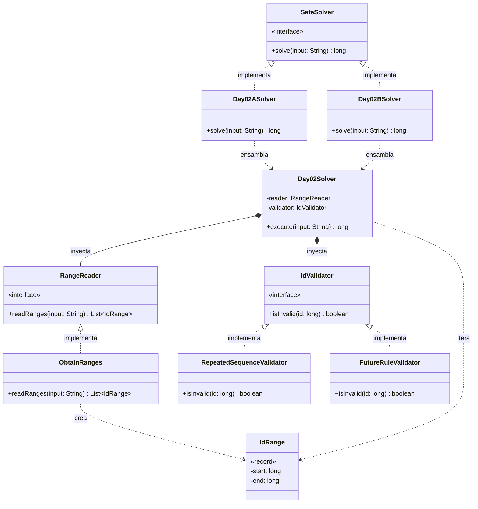

# Día 1: Secret Entrance

## Descripción del Problema

El objetivo de este reto es descifrar la combinación de seguridad de la entrada secreta al taller de Papá Noel resolviendo las rotaciones físicas del dial circular de la caja fuerte (números del `0` al `99`). El dial parte inicialmente apuntando a la posición `50`.

*   **Parte A**: Un código o password es el número de veces que el dial queda apuntando exactamente a la posición **`0`** inmediatamente después de haber ejecutado cualquier rotación completa de la secuencia (por ejemplo, tras completar `L68` o `R48`).
*   **Parte B**: La especificación se actualiza de manera física. Ahora el password es el número total de veces que el dial **pasa o toca** la posición **`0`** a lo largo de todo el movimiento de giro de la secuencia de rotaciones (incluyendo pasos intermedios y finales).

---

## Explicación de las Relaciones y Elementos

*   **Implementación:** `Day02ASolver` y `Day01BSolver` implementan la interfaz `Solver`, exponiendo así únicamente el método público `solve` hacia el exterior.
*   **Ensamblaje e Inyección:** Los solvers específicos (`Day01ASolver/B`) instancian las dependencias correctas (ej. `EndAtZero`) y se las inyectan al motor principal (`Day01Solver`), el cual ejecuta el algoritmo de forma agnóstica a través de su método `execute`.
*   **Composición y Uso:** `Day01Solver` contiene a `RotationReader` y `TotalScorer`, delegando en ellos. A su vez, todos los dominios se comunican de forma fuertemente tipada utilizando los Records inmutables `Dial` y `Rotation`.

---

## Arquitectura de Clases y Responsabilidades

- **Los Ensambladores y el Motor Principal:**
  *   `Solver` **(Interfaz):** Contrato global del repositorio para la ejecución de cualquier día.
  *   `Day02ASolver` / `Day01BSolver` **(Clases):** Implementan `Solver`. Configuran las dependencias concretas para la Parte A o B y se las pasan al motor genérico.
  *   `Day01Solver` **(Clase):** Actúa como el motor principal agnóstico. Recibe las dependencias inyectadas por constructor (`RotationReader` y `TotalScorer`) y orquesta el flujo (lee, itera, gira el dial y evalúa puntos).
- **Dominio de Lectura (Abstracción y Value Objects):**
  *   `RotationReader` **(Interfaz):** Establece el contrato público para la lectura de datos.
  *   `ObtainRotation` **(Clase):** Implementa el contrato utilizando la API de Streams de Java para transformar el archivo de texto en una lista de objetos `Rotation`.
  *   `Rotation` **(Record):** *Value Object* inmutable que encapsula la instrucción analizada (`dirección` y `pasos`), liberando al resto del sistema de la responsabilidad de parsear *Strings*.
- **Dominio de Puntuación (Polimorfismo):**
  *   `TotalScorer` **(Interfaz):** Interfaz que define el contrato `calculateScore(oldDial, newDial, rotation)` permitiendo la inyección de la lógica de negocio.
  *   `EndAtZero` **(Clase):** Implementación concreta de la Parte A.
  *   `PassThroughZero` **(Clase):** Implementación concreta de la Parte B.
- **Dominio de Estado (Inmutabilidad):**
  *   `Dial` **(Record):** Modela el comportamiento físico de la caja fuerte. Actúa como un módulo altamente cohesivo que aplica la matemática del módulo circular recibiendo un objeto `Rotation` para calcular la nueva posición, retornando siempre un nuevo estado para evitar la mutación.

---

## Fundamentos y Principios de Diseño Aplicados

El diseño de esta solución se ha construido sobre los pilares de la calidad de software, separando responsabilidades y garantizando la mantenibilidad del código:

*   **Principio de Responsabilidad Única (SRP):** Cada módulo en el sistema se centra en una tarea específica. Por ejemplo, `TotalScorer` solo calcula puntos y `RotationReader` solo procesa texto, asegurando que cada clase tenga una única razón para cambiar y sea más fácil de probar.
*   **Abstracción y Diseño por Contrato:** Se utilizan interfaces (`TotalScorer` y `RotationReader`) como un contrato que define métodos públicos, ocultando detalles complejos de implementación. Esto facilita comprender el comportamiento del código sin necesidad de analizar operaciones interconectadas.
*   **Bajo Acoplamiento e Inyección de Dependencias:** El `Day01Solver` no crea sus propias dependencias, sino que estas se inyectan desde fuera separando la creación del objeto con su uso, reduciendo la dependencia interna y permitiendo reemplazar módulos sin afectar al estado del sistema.
*   **Principio Abierto Cerrado (OCP):** El diseño permite añadir nuevas reglas de puntuación creando nuevas clases, extendiendo el comportamiento sin necesidad de modificar el código existente.
*   **Principio de Sustitución de Liskov (LSP):** Cualquier objeto de un subtipo (como `EndAtZero` y `PassThroughZero`) puede sustituir a un supertipo (`TotalScorer`) garantizando la interoperabilidad sin alterar la correctitud del programa.
*   **Principio de Inversión de Dependencias (DIP):** El módulo de alto nivel (`Day01Solver`) no depende de las implementaciones concretas de bajo nivel, sino que depende directamente de las abstracciones.

---

## Mecanismos del Lenguaje

Para llegar a cabo esta arquitectura, se han empleado las siguientes características avanzadas de Java:

*   **Polimorfismo (Upcasting):** Las instancias de tipos específicos se asignan de forma automática y segura a variables de supertipo (interfaz), permitiendo trabajar con los objetos de manera genérica.
*   **API de Streams:** Se utiliza para el procesamiento declarativo y funcional del archivo de entrada en `ObtainRotation`. Mediante operaciones intermedias (como `map` o `filter`) y operaciones terminales (como `collect`), se transforma el texto en objetos manejables.
*   **Clases Internas de Clase (Static):** Entidades inmutables como el `Dial` pueden ser encapsuladas como clases estáticas internas, ya que pertenecen lógicamente a la estructura pero no necesitan acceso a los miembros de la instancia externa.