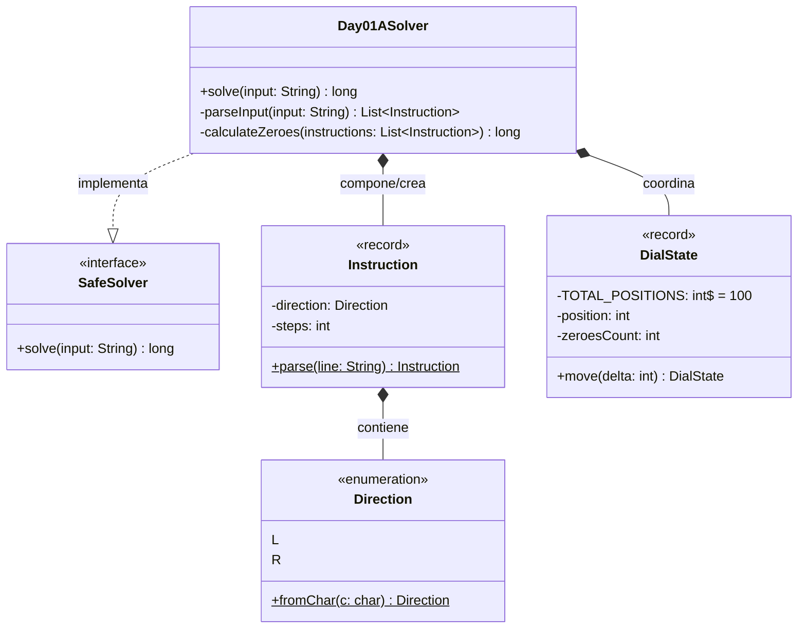

# Día 1: Secret Entrance

## Descripción del Problema

El objetivo de este reto es descifrar la combinación de seguridad de la entrada secreta al taller de Papá Noel resolviendo las rotaciones físicas del dial circular de la caja fuerte (números del `0` al `99`). El dial parte inicialmente apuntando a la posición `50`.

*   **Parte A**: Un código o password es el número de veces que el dial queda apuntando exactamente a la posición **`0`** inmediatamente después de haber ejecutado cualquier rotación completa de la secuencia (por ejemplo, tras completar `L68` o `R48`).
*   **Parte B**: La especificación se actualiza de manera física. Ahora el password es el número total de veces que el dial **pasa o toca** la posición **`0`** a lo largo de todo el movimiento de giro de la secuencia de rotaciones (incluyendo pasos intermedios y finales).

---

## Explicación de las Relaciones y Elementos

- **Day01Solver** implementa la interfaz **SafeSolver**, exponiendo así únicamente al método público `solve``.
- 

---

## Arquitectura del Día

La arquitectura sigue estrictamente los principios de Inversión de Dependencias y Responsabilidad Única. El parser lee y genera tipos de dominio inmutables, el Dial ejecuta la física y las estrategias computan las puntuaciones de forma aislada.

---

## Patrones de Diseño Aplicados

*   **Adapter Pattern (Reader)**: Aislamos la entrada cruda del solver mediante `RotationReader`. El solver nunca hace `split` ni manipula strings; recibe una secuencia limpia de records de dominio `Rotation`.
*   **Strategy Pattern (Scorers)**: La lógica que dictamina si una rotación cuenta como acierto (Parte A: finaliza en 0; Parte B: pasa o toca el 0) se abstrae mediante la interfaz `RotationScorer` e implementaciones concretas `EndAtZeroScorer` y `PassThroughZeroScorer`, facilitando la extensibilidad sin alterar el orquestador principal.

---

## Principios de Diseño Aplicados

Durante la implementación de este día se han respetado rigurosamente los siguientes principios de diseño:

*   **Principio de Responsabilidad Única (SRP)**: Cada clase tiene un único propósito. `StringRotationReader` se encarga exclusivamente de interpretar el texto de entrada, `Dial` maneja la física del dispositivo circular y los *Scorers* evalúan las reglas de puntuación de forma aislada.
*   **Principio Abierto/Cerrado (OCP)**: Gracias al patrón Strategy (`RotationScorer`), el sistema está abierto a la extensión (nuevas formas de puntuar, como en la Parte B) pero cerrado a la modificación (el `Day01Solver` no altera su núcleo).
*   **Principio de Inversión de Dependencias (DIP)**: El orquestador `Day01Solver` depende exclusivamente de abstracciones (`RotationReader` y `RotationScorer`), no de sus implementaciones concretas, lo que facilita enormemente la inyección de dependencias y la realización de pruebas unitarias (TDD).
*   **Principio DRY (Don't Repeat Yourself)**: La lógica matemática subyacente al movimiento en módulo 100 está confinada exclusivamente a la clase `Dial`, lo que impide la redundancia algorítmica y los posibles desajustes si cambian los límites del dial en el futuro.