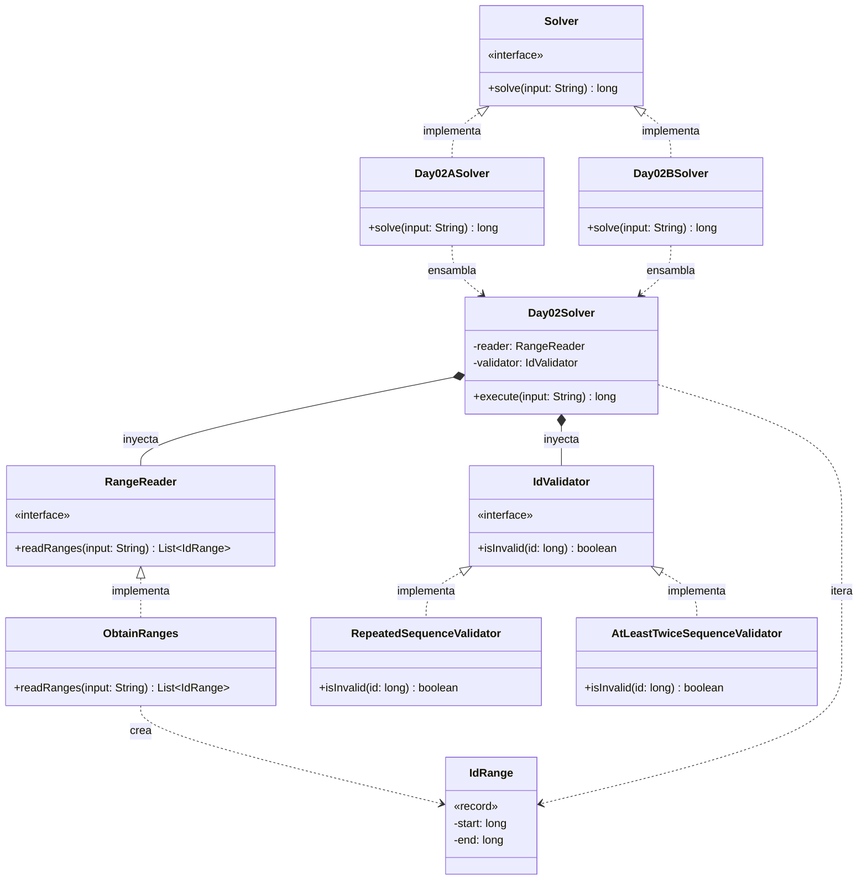

# Día 2: Gift Shop

## Descripción del Problema

El objetivo de este reto es ayudar a los Elfos a identificar IDs de productos inválidos que fueron introducidos accidentalmente en la base de datos de la tienda de regalos del Polo Norte. El archivo de entrada consiste en una única línea con múltiples rangos de IDs separados por comas. Cada rango indica el primer y el último ID a revisar, separados por un guion.

*   **Parte A**: Un ID de producto se considera inválido si está formado únicamente por una secuencia de dígitos que se repite **exactamente dos veces** (por ejemplo, `55`, `6464` o `123123`).
*   **Parte B**: La regla se generaliza: un ID es inválido si está formado únicamente por una secuencia de dígitos repetida **dos o más veces**, sin importar cuántas (por ejemplo, `123123123` es la secuencia `123` repetida tres veces, y `1111111` es `1` repetida siete veces). Hay que recalcular el total de IDs inválidos con esta regla ampliada.

---

## Explicación de las Relaciones y Elementos

*   **Implementación:** `Day02ASolver` y `Day02BSolver` implementan la interfaz `Solver`, exponiendo así únicamente el método público `solve` hacia el exterior.
*   **Ensamblaje e Inyección:** Los solvers específicos (`Day02ASolver`/`Day02BSolver`) instancian las dependencias correctas (`RepeatedSequenceValidator` o `AtLeastTwiceSequenceValidator`) y se las inyectan al motor principal (`Day02Solver`), el cual se ejecuta a través de su método `execute`.
*   **Composición y Uso:** `Day02Solver` contiene `RangeReader` e `IdValidator`, delegando en ellos. A su vez, los dominios se comunican haciendo uso de un Record inmutable llamado `IdRange`.
*   **Nota de nomenclatura:** el validador de la Parte B se llama `AtLeastTwiceSequenceValidator`, no `FutureRuleValidator` como en una versión anterior de este documento — el nombre anterior no comunicaba qué regla de negocio implementa la clase. El nombre actual deja explícito que es una generalización de la regla de `RepeatedSequenceValidator` (secuencia repetida exactamente 2 veces) a cualquier número de repeticiones.

---

## Arquitectura de Clases y Responsabilidades

- **Los Ensambladores y el Motor Principal:**
  *   `Solver` **(Interfaz):** Contrato global del repositorio para la ejecución de cualquier día.
  *   `Day02ASolver` / `Day02BSolver` **(Clases):** Implementan `Solver`. Configuran las dependencias concretas para la Parte A o B y se las pasan al motor genérico.
  *   `Day02Solver` **(Clase):** Actúa como el motor principal agnóstico. Recibe las dependencias inyectadas por constructor (`RangeReader` y `IdValidator`) y orquesta el flujo (lee los rangos, itera sobre los IDs y suma los que no cumplen la validación).
- **Dominio de Lectura (Abstracción y Value Objects):**
  *   `RangeReader` **(Interfaz):** Establece el contrato público para la lectura de los rangos.
  *   `ObtainRanges` **(Clase):** Implementa el contrato utilizando la API de Streams de Java para transformar la cadena de rangos separada por comas en una lista de objetos `IdRange`.
  *   `IdRange` **(Record):** *Value Object* inmutable que encapsula el inicio y el fin del rango (`start` y `end`), liberando al resto del sistema de la responsabilidad de hacer *splits* de cadenas.
- **Dominio de Validación (Polimorfismo):**
  *   `IdValidator` **(Interfaz):** Interfaz que define el contrato `isInvalid(id)`, permitiendo la inyección de la lógica de negocio y las reglas de filtrado.
  *   `RepeatedSequenceValidator` **(Clase):** Implementación concreta para la Parte A — un ID es inválido si es una secuencia de dígitos repetida exactamente dos veces.
  *   `AtLeastTwiceSequenceValidator` **(Clase):** Implementación concreta para la Parte B — un ID es inválido si es una secuencia de dígitos repetida dos o más veces, generalizando la regla anterior.
- **Dominio de Estado (Inmutabilidad):**
  *   En este día el estado a evaluar es un `long id`, por lo que la inmutabilidad se garantiza procesando esos datos mediante Streams o bucles puros, sin mutar variables globales.

---

## Fundamentos y Principios de Diseño Aplicados

El diseño de esta solución se ha construido sobre los pilares de la calidad de software, separando responsabilidades y garantizando la mantenibilidad del código:

*   **Principio de Responsabilidad Única (SRP):** Cada módulo en el sistema se centra en una tarea específica. `IdValidator` solo decide si un número es válido y `RangeReader` solo procesa texto, asegurando que cada clase tenga una única razón para cambiar y sea más fácil de probar.
*   **Abstracción y Diseño por Contrato:** Se utilizan interfaces (`IdValidator` y `RangeReader`) como un contrato que define métodos públicos, ocultando detalles complejos de implementación (como las expresiones regulares o las matemáticas usadas para detectar secuencias repetidas).
*   **Bajo Acoplamiento e Inyección de Dependencias:** `Day02Solver` no crea sus propias dependencias, sino que estas se inyectan desde fuera, separando la creación del objeto de su uso y permitiendo reemplazar módulos sin afectar al estado del sistema.
*   **Principio Abierto/Cerrado (OCP):** El diseño permite añadir nuevas reglas de validación de IDs creando nuevas clases que implementen `IdValidator`, sin necesidad de modificar el código orquestador existente.
*   **Principio de Sustitución de Liskov (LSP):** Cualquier objeto de un subtipo (`RepeatedSequenceValidator`, `AtLeastTwiceSequenceValidator`) puede sustituir a su supertipo (`IdValidator`) garantizando la interoperabilidad sin alterar el programa.
*   **Principio de Inversión de Dependencias (DIP):** `Day02Solver`, como módulo de alto nivel, no depende de implementaciones concretas de bajo nivel, sino directamente de las abstracciones `RangeReader` e `IdValidator`.
*   **Nomenclatura significativa:** el nombre de cada validador refleja la regla de negocio que implementa, evitando nombres opacos o genéricos que obliguen a leer la implementación para entender qué hace la clase.

---

## Mecanismos del Lenguaje

Para llevar a cabo esta arquitectura, se han empleado las siguientes características avanzadas de Java:

*   **Polimorfismo (Upcasting):** Las instancias de tipos específicos se asignan de forma automática y segura a variables de supertipo (interfaz), permitiendo trabajar con los objetos de manera genérica.
*   **API de Streams:** Se utiliza para el procesamiento declarativo. `Arrays.stream()` se emplea para parsear (`ObtainRanges`) dividiendo por comas, y `LongStream.rangeClosed()` se usa de forma eficiente para generar e iterar sobre los números comprendidos dentro de cada `IdRange`, procesándolos sin el sobrecoste del autoboxing.
*   **Records:** Entidades puramente portadoras de datos inmutables como `IdRange` se encapsulan utilizando `record`, proporcionando constructores, *getters*, `equals` y `hashCode` de fábrica.