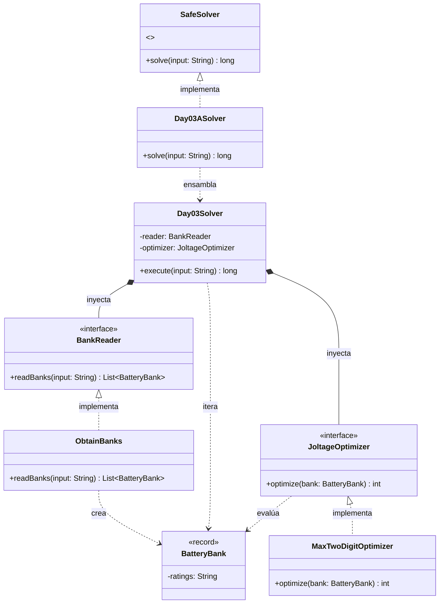

# Día 3: Lobby

## Descripción del Problema

El objetivo de este reto es ayudar a un Elfo a restaurar la energía de las escaleras mecánicas en el vestíbulo del Polo Norte utilizando bancos de baterías de emergencia. Cada banco de baterías se representa como una cadena de dígitos del 1 al 9.

*   **Parte A**: En cada banco de baterías, se deben encender exactamente dos de ellas, manteniendo su orden original de aparición. El objetivo es encontrar la combinación de dos baterías que forme el número de dos dígitos más alto posible (el mayor voltaje) para cada banco, y luego calcular la **suma total** del voltaje máximo de todos los bancos.
*   **Parte B**: *(La especificación se desbloqueará al completar la Parte A. La arquitectura está preparada para inyectar la nueva regla de optimización sin modificar el motor principal).*

---

## Explicación de las Relaciones y Elementos

*   **Implementación:** `Day03ASolver` implementa la interfaz `SafeSolver`, exponiendo así únicamente el método público `solve` hacia el exterior.
*   **Ensamblaje e Inyección:** Los solvers específicos (`Day03ASolver`) instancian las dependencias correctas (ej. `MaxTwoDigitOptimizer`) y se las inyectan al motor principal (`Day03Solver`), el cual ejecuta el algoritmo de forma agnóstica a través de su método `execute`.
*   **Composición y Uso:** `Day03Solver` contiene a `BankReader` y `JoltageOptimizer`, delegando en ellos. A su vez, los dominios se comunican de forma fuertemente tipada utilizando el Record inmutable `BatteryBank`.

---

## Arquitectura de Clases y Responsabilidades

- **Los Ensambladores y el Motor Principal:**
    *   `SafeSolver` **(Interfaz):** Contrato global del repositorio para la ejecución de cualquier día.
    *   `Day03ASolver` **(Clase):** Implementa `SafeSolver`. Configura las dependencias concretas para la Parte A y se las pasa al motor genérico.
    *   `Day03Solver` **(Clase):** Actúa como el motor principal agnóstico. Recibe las dependencias inyectadas por constructor (`BankReader` y `JoltageOptimizer`) y orquesta el flujo.
- **Dominio de Lectura (Abstracción y Value Objects):**
    *   `BankReader` **(Interfaz):** Establece el contrato público para la extracción de los bancos de baterías.
    *   `ObtainBanks` **(Clase):** Implementa el contrato utilizando la API de Streams de Java para transformar el archivo de texto en una lista de objetos `BatteryBank`.
    *   `BatteryBank` **(Record):** *Value Object* inmutable que encapsula la secuencia de dígitos (`ratings`), liberando al resto del sistema de validaciones o manipulaciones erróneas.
- **Dominio de Optimización (Polimorfismo):**
    *   `JoltageOptimizer` **(Interfaz):** Interfaz que define el contrato `optimize(bank)` permitiendo la inyección de la lógica de negocio para maximizar el voltaje.
    *   `MaxTwoDigitOptimizer` **(Clase):** Implementación concreta de la Parte A (busca el mayor número de dos dígitos manteniendo el orden).
- **Dominio de Estado (Inmutabilidad):**
    *   La inmutabilidad se garantiza mediante el uso del record `BatteryBank`.

---

## Fundamentos y Principios de Diseño Aplicados

El diseño de esta solución garantiza la mantenibilidad del código basándose en fundamentos clave de la Ingeniería del Software:

*   **Principio de Responsabilidad Única (SRP):** Cada módulo en el sistema se centra en una tarea específica. Por ejemplo, `JoltageOptimizer` solo decide la mejor puntuación posible de un banco y `BankReader` solo procesa texto.
*   **Abstracción y Diseño por Contrato:** Se utilizan interfaces (`JoltageOptimizer` y `BankReader`) como un contrato que define métodos públicos, ocultando detalles complejos de implementación.
*   **Bajo Acoplamiento e Inyección de Dependencias:** El `Day03Solver` no crea sus propias dependencias, sino que estas se inyectan desde fuera separando la creación del objeto con su uso, reduciendo la dependencia interna y permitiendo reemplazar módulos sin afectar al estado del sistema.
*   **Principio Abierto Cerrado (OCP):** El diseño permite añadir nuevas reglas de validación de IDs creando nuevas clases, extendiendo el comportamiento sin necesidad de modificar el código orquestador existente.
*   **Principio de Sustitución de Liskov (LSP):** Cualquier objeto de un subtipo (como `RepeatedSequenceValidator`) puede sustituir a un supertipo (`IdValidator`) garantizando la interoperabilidad sin alterar el programa.
*   **Principio de Inversión de Dependencias (DIP):** El módulo de alto nivel (`Day03Solver`) no depende de las implementaciones concretas de bajo nivel, sino que depende directamente de las abstracciones.

---

## Mecanismos del Lenguaje

Para llegar a cabo esta arquitectura, se han empleado las siguientes características avanzadas de Java:

*   **Polimorfismo (Upcasting):** Las instancias de tipos específicos (como `MaxTwoDigitOptimizer`) se asignan de forma automática y segura a variables de supertipo (interfaz), permitiendo trabajar con los objetos de manera genérica.
*   **API de Streams:** Se utiliza para el procesamiento declarativo para transformar el texto plano en colecciones funcionales durante la lectura de la entrada.
*   **Records:** Entidades puramente portadoras de datos inmutables que se encapsulan utilizando record, evitando el riesgo de efectos secundarios imprevistos.

