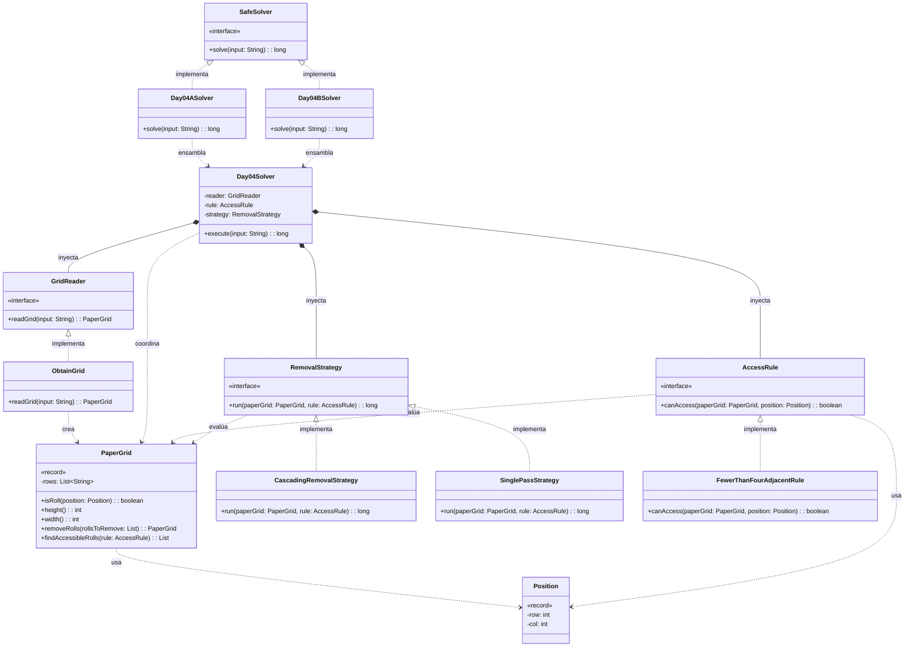

# Día 4: Printing Department

## Descripción del Problema

El objetivo de este reto es optimizar el trabajo de las carretillas elevadoras en el departamento de impresión del Polo Norte para que los Elfos tengan tiempo de derribar un muro hacia la cafetería. Se nos proporciona un mapa (cuadrícula 2D) con la ubicación de los rollos de papel gigantes (`@`) y espacios vacíos (`.`).

*   **Parte A**: Las carretillas solo pueden acceder a un rollo de papel si este tiene **estrictamente menos de cuatro rollos adyacentes** en las ocho direcciones posibles (arriba, abajo, izquierda, derecha y las cuatro diagonales). El objetivo es contar cuántos rollos de papel en todo el mapa cumplen esta condición de accesibilidad.
*   **Parte B**: Una vez que un rollo es accesible, las carretillas lo retiran del mapa, lo que puede volver accesibles a otros rollos en cascada. El objetivo es ejecutar una simulación cíclica, retirando rollos iterativamente y actualizando el mapa hasta que el sistema se estabilice (ningún rollo más sea accesible), calculando el número total de rollos retirados.

---

## Explicación de las Relaciones y Elementos

*   **Implementación:** `Day04ASolver` implementa la interfaz `SafeSolver`, exponiendo así únicamente el método público `solve` hacia el exterior.
*   **Ensamblaje e Inyección:** El solver específico (`Day04ASolver` / `Day04BSolver`) instancia las dependencias correctas y se las inyecta al motor principal (`Day04Solver`), el cual ejecuta el algoritmo de forma agnóstica a través de sus métodos públicos.
*   **Composición y Uso:** `Day04Solver` contiene a `GridReader` y `AccessRule`, delegando en ellos. A su vez, los dominios se comunican de forma fuertemente tipada utilizando el Record inmutable `PaperGrid`.

---

## Arquitectura de Clases y Responsabilidades

- **Los Ensambladores y el Motor Principal:**
    *   `SafeSolver` **(Interfaz):** Contrato global del repositorio para la ejecución de cualquier día.
    *   `Day04ASolver` / `Day04bSolver` **(Clases):** Implementan `SafeSolver`. Configura las dependencias concretas para la Parte A y B y se las pasa al motor genérico.
    *   `Day04Solver` **(Clase):** Actúa como el motor principal agnóstico. Orquesta el flujo delegando el escaneo de la cuadrícula a un método privado (**DRY**) y ejecutando una pasada simple (`execute`) o una simulación cíclica (`executeSimulation`).
- **Dominio de Lectura (Abstracción y Value Objects):**
    *   `GridReader` **(Interfaz):** Establece el contrato público para la extracción del mapa.
    *   `ObtainGrid` **(Clase):** Implementa el contrato utilizando la API de Streams de Java para transformar el archivo de texto en un objeto `PaperGrid`.
    *   `PaperGrid` **(Record):** *Value Object* inmutable que encapsula la matriz bidimensional. Proporciona el método `removeRolls` para generar nuevos estados inmutables delegando tareas atómicas a métodos privados internos.
- **Dominio de Reglas (Polimorfismo):**
    *   `AccessRule` **(Interfaz):** Interfaz que define el contrato `canAccess(paperGrid, row, col)` permitiendo la inyección de la lógica de negocio.
    *   `FewerThanFourAdjacentRule` **(Clase):** Implementación concreta y reutilizable de la regla de acceso (busca los 8 vecinos y valida que haya menos de 4 rollos).

---

## Fundamentos y Principios de Diseño Aplicados

El diseño de esta solución garantiza la mantenibilidad del código basándose en fundamentos clave de la Ingeniería del Software:

*   **Principio de Responsabilidad Única (SRP):** Cada módulo y método se centra en una tarea específica. Por ejemplo, `PaperGrid#removeRolls` divide su lógica en métodos privados (crear copia mutable, reemplazar datos, sellar estado), y `Day04Solver` delega la búsqueda a `findAccessibleRolls`.
*   **Principio DRY (Don't Repeat Yourself):** Se ha evitado la duplicación de código extrayendo el bucle de búsqueda de coordenadas a un único método privado en el orquestador, sirviendo tanto a la Parte A como a la Parte B.
*   **Abstracción y Diseño por Contrato:** Se utilizan interfaces (`AccessRule` y `GridReader`) como un contrato que define métodos públicos, asegurando que los detalles de implementación permanezcan ocultos.
*   **Bajo Acoplamiento e Inyección de Dependencias:** El `Day04Solver` no crea sus propias dependencias, sino que estas se inyectan desde fuera separando la creación del objeto con su uso, reduciendo la dependencia interna y permitiendo reemplazar módulos sin afectar al estado del sistema.
*   **Principio Abierto Cerrado (OCP):** El diseño permite añadir nuevas reglas de acceso extendiendo el comportamiento (mediante nuevas clases) o incorporar nuevas simulaciones sin modificar la lógica principal de la regla.
*   **Principio de Sustitución de Liskov (LSP):** Cualquier objeto de un subtipo (como `FewerThanFourAdjacentRule`) puede sustituir a un supertipo (`AccessRule`) garantizando la interoperabilidad sin alterar el programa.
*   **Inmutabilidad del Estado:** El dominio central (`PaperGrid`) nunca altera sus datos internos. Las modificaciones de la Parte B siempre retornan una nueva instancia limpia, eliminando efectos secundarios impredecibles.
---

## Mecanismos del Lenguaje

Para llegar a cabo esta arquitectura, se han empleado las siguientes características avanzadas de Java:

*   **Polimorfismo (Upcasting):** Las instancias de tipos específicos se asignan de forma automática y segura a variables de supertipo, permitiendo trabajar con los objetos de manera genérica.
*   **API de Streams:** Se utiliza para el procesamiento declarativo, facilitando el clonado y modificación de colecciones (como la copia profunda de filas en el grid) de forma limpia y funcional.
*   **Records:** Entidades puramente portadoras de datos que se encapsulan de forma inmutable, actuando como escudo protector (por ejemplo, manejando internamente los límites de la matriz y evitando `IndexOutOfBoundsException`).

