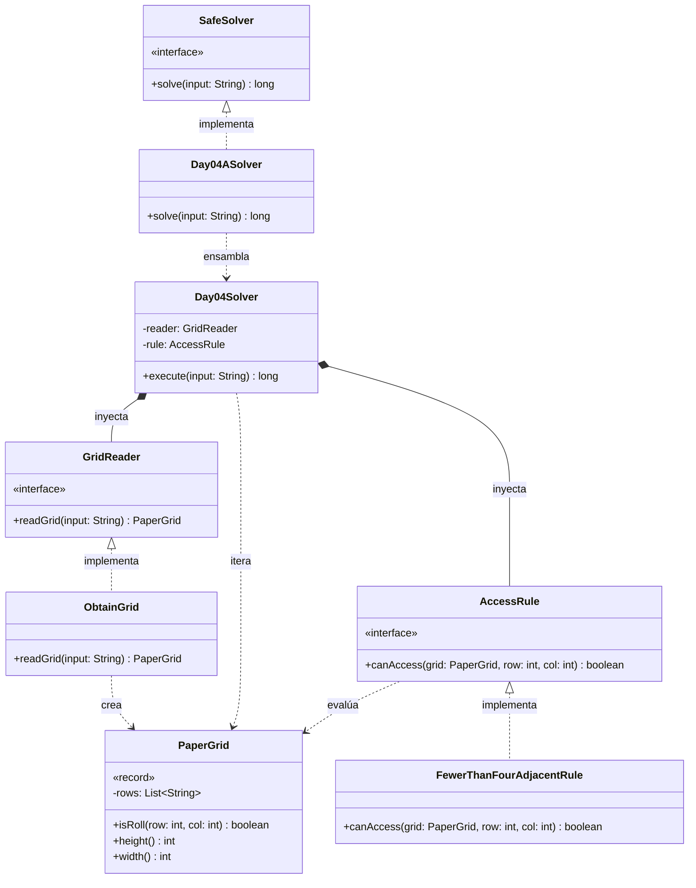

# Día 4: Printing Department

## Descripción del Problema

El objetivo de este reto es optimizar el trabajo de las carretillas elevadoras en el departamento de impresión del Polo Norte para que los Elfos tengan tiempo de derribar un muro hacia la cafetería. Se nos proporciona un mapa (cuadrícula 2D) con la ubicación de los rollos de papel gigantes (`@`) y espacios vacíos (`.`).

*   **Parte A**: Las carretillas solo pueden acceder a un rollo de papel si este tiene **estrictamente menos de cuatro rollos adyacentes** en las ocho direcciones posibles (arriba, abajo, izquierda, derecha y las cuatro diagonales). El objetivo es contar cuántos rollos de papel en todo el mapa cumplen esta condición de accesibilidad.
*   **Parte B**: *(La especificación se desbloqueará al completar la Parte A. La arquitectura está preparada para inyectar una nueva regla de accesibilidad sin modificar el motor principal).*

---

## Explicación de las Relaciones y Elementos

*   **Implementación:** `Day04ASolver` implementa la interfaz `SafeSolver`, exponiendo así únicamente el método público `solve` hacia el exterior.
*   **Ensamblaje e Inyección:** El solver específico (`Day04ASolver`) instancia las dependencias correctas (ej. `FewerThanFourAdjacentRule`) y se las inyecta al motor principal (`Day04Solver`), el cual ejecuta el algoritmo de forma agnóstica a través de su método `execute`.
*   **Composición y Uso:** `Day04Solver` contiene a `GridReader` y `AccessRule`, delegando en ellos. A su vez, los dominios se comunican de forma fuertemente tipada utilizando el Record inmutable `PaperGrid`.

---

## Arquitectura de Clases y Responsabilidades

- **Los Ensambladores y el Motor Principal:**
    *   `SafeSolver` **(Interfaz):** Contrato global del repositorio para la ejecución de cualquier día.
    *   `Day04ASolver` **(Clase):** Implementa `SafeSolver`. Configura las dependencias concretas para la Parte A y se las pasa al motor genérico.
    *   `Day04Solver` **(Clase):** Actúa como el motor principal agnóstico. Recibe las dependencias inyectadas por constructor (`GridReader` y `AccessRule`) y orquesta el flujo (iterando por toda la cuadrícula y contando los rollos accesibles).
- **Dominio de Lectura (Abstracción y Value Objects):**
    *   `GridReader` **(Interfaz):** Establece el contrato público para la extracción del mapa.
    *   `ObtainGrid` **(Clase):** Implementa el contrato utilizando la API de Streams de Java para transformar el archivo de texto en un objeto `PaperGrid`.
    *   `PaperGrid` **(Record):** *Value Object* inmutable que encapsula la matriz bidimensional, liberando al resto del sistema de manejar directamente listas o arrays crudos y evitando excepciones de límites (Out of Bounds).
- **Dominio de Reglas (Polimorfismo):**
    *   `AccessRule` **(Interfaz):** Interfaz que define el contrato `canAccess(grid, row, col)` permitiendo la inyección de la lógica de negocio.
    *   `FewerThanFourAdjacentRule` **(Clase):** Implementación concreta de la Parte A (busca los 8 vecinos y valida que haya menos de 4 rollos).
- **Dominio de Estado (Inmutabilidad):**
    *   La inmutabilidad se garantiza mediante el uso del record `PaperGrid`.

---

## Fundamentos y Principios de Diseño Aplicados

El diseño de esta solución garantiza la mantenibilidad del código basándose en fundamentos clave de la Ingeniería del Software:

*   **Principio de Responsabilidad Única (SRP):** Cada módulo en el sistema se centra en una tarea específica. Por ejemplo, `AccessRule` solo decide si una coordenada es accesible y `GridReader` solo procesa texto.
*   **Abstracción y Diseño por Contrato:** Se utilizan interfaces (`AccessRule` y `GridReader`) como un contrato que define métodos públicos, asegurando que los detalles de implementación permanezcan ocultos.
*   **Bajo Acoplamiento e Inyección de Dependencias:** El `Day04Solver` no crea sus propias dependencias, sino que estas se inyectan desde fuera separando la creación del objeto con su uso, reduciendo la dependencia interna y permitiendo reemplazar módulos sin afectar al estado del sistema.
*   **Principio Abierto Cerrado (OCP):** El diseño permite añadir nuevas reglas de optimización de voltaje extendiendo el comportamiento (mediante nuevas clases) pero cerradas para la modificación del código orquestador existente.
*   **Principio de Sustitución de Liskov (LSP):** Cualquier objeto de un subtipo (como `MaxTwelveDigitOptimizer`) puede sustituir a un supertipo (`JoltageOptimizer`) garantizando la interoperabilidad sin alterar el programa.
*   **Principio de Inversión de Dependencias (DIP):** El módulo de alto nivel (`Day04Solver`) no depende de las implementaciones concretas de bajo nivel, sino que depende directamente de las abstracciones.

---

## Mecanismos del Lenguaje

Para llegar a cabo esta arquitectura, se han empleado las siguientes características avanzadas de Java:

*   **Polimorfismo (Upcasting):** Las instancias de tipos específicos (como `FewerThanFourAdjacentRule`) se asignan de forma automática y segura a variables de supertipo (interfaz), permitiendo trabajar con los objetos de manera genérica.
*   **API de Streams:** Se utiliza para el procesamiento declarativo, ya que facilita el procesamiento funcional de las colecciones de datos, permitiendo operaciones más eficientes y legibles durante la lectura de la entrada.
*   **Records:** Entidades puramente portadoras de datos inmutables que se encapsulan utilizando record, evitando el riesgo de efectos secundarios imprevistos.

