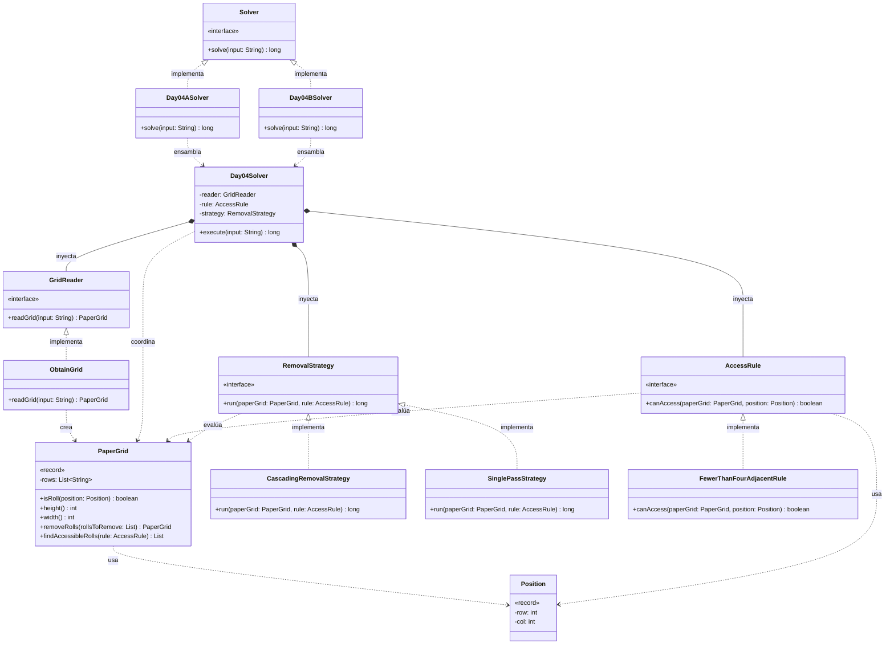

# Día 4: Printing Department

## Descripción del Problema

El objetivo de este reto es optimizar el trabajo de las carretillas elevadoras en el departamento de impresión del Polo Norte para que los Elfos tengan tiempo de derribar un muro hacia la cafetería. Se nos proporciona un mapa (cuadrícula 2D) con la ubicación de los rollos de papel gigantes (`@`) y espacios vacíos (`.`).

*   **Parte A**: Las carretillas solo pueden acceder a un rollo de papel si este tiene **estrictamente menos de cuatro rollos adyacentes** en las ocho direcciones posibles (arriba, abajo, izquierda, derecha y las cuatro diagonales). El objetivo es contar cuántos rollos de papel en todo el mapa cumplen esta condición de accesibilidad.
*   **Parte B**: Una vez que un rollo es accesible, las carretillas lo retiran del mapa, lo que puede volver accesibles a otros rollos en cascada. El objetivo es ejecutar una simulación cíclica, retirando rollos iterativamente y actualizando el mapa hasta que el sistema se estabilice (ningún rollo más sea accesible), calculando el número total de rollos retirados.

---

## Explicación de las Relaciones y Elementos

*   **Implementación:** `Day04ASolver` implementa la interfaz `Solver`, exponiendo así únicamente el método público `solve` hacia el exterior.
*   **Ensamblaje e Inyección:** El solver específico (`Day04ASolver` / `Day04BSolver`) instancia las dependencias correctas —incluyendo la estrategia de eliminación adecuada— y se las inyecta al motor principal (`Day04Solver`), el cual ejecuta el algoritmo de forma agnóstica a través de un único método público.
*   **Composición y Uso:** `Day04Solver` contiene a `GridReader`, `AccessRule` y `RemovalStrategy`, delegando en ellos. A su vez, los dominios se comunican de forma fuertemente tipada utilizando los Records inmutables `PaperGrid` y `Position`.

---

## Arquitectura de Clases y Responsabilidades

- **Los Ensambladores y el Motor Principal:**
  *   `Solver` **(Interfaz):** Contrato global del repositorio para la ejecución de cualquier día.
  *   `Day04ASolver` / `Day04BSolver` **(Clases):** Implementan `Solver`. Configuran las dependencias concretas para la Parte A y B (en particular, qué `RemovalStrategy` corresponde a cada una) y se las pasan al motor genérico.
  *   `Day04Solver` **(Clase):** Actúa como el motor principal agnóstico. Se limita a leer el input y delegar la ejecución completa en la `RemovalStrategy` inyectada, sin conocer si se trata de una pasada simple o de una simulación cíclica.
- **Dominio de Lectura (Abstracción y Value Objects):**
  *   `GridReader` **(Interfaz):** Establece el contrato público para la extracción del mapa.
  *   `ObtainGrid` **(Clase):** Implementa el contrato utilizando la API de Streams de Java para transformar el archivo de texto en un objeto `PaperGrid`.
  *   `PaperGrid` **(Record):** *Value Object* inmutable que encapsula la matriz bidimensional. Es responsable tanto de consultarse a sí mismo (`isRoll`, `findAccessibleRolls`) como de generar nuevos estados inmutables (`removeRolls`), delegando tareas atómicas a métodos privados internos.
  *   `Position` **(Record):** *Value Object* que representa una coordenada `(row, col)` dentro del grid, evitando el uso de arrays primitivos sin significado semántico en el resto del dominio.
- **Dominio de Reglas (Polimorfismo):**
  *   `AccessRule` **(Interfaz):** Interfaz que define el contrato `canAccess(paperGrid, position)`, permitiendo la inyección de la lógica de negocio que decide si un rollo es accesible.
  *   `FewerThanFourAdjacentRule` **(Clase):** Implementación concreta y reutilizable de la regla de acceso (busca los 8 vecinos y valida que haya menos de 4 rollos). Es la misma regla para ambas partes; lo que cambia entre A y B no es la regla, sino el proceso que la aplica.
- **Dominio de Estrategia (Polimorfismo):**
  *   `RemovalStrategy` **(Interfaz):** Define el contrato `run(paperGrid, rule)`, permitiendo inyectar el *proceso* completo de resolución sin que `Day04Solver` conozca sus detalles.
  *   `SinglePassStrategy` **(Clase):** Implementación para la Parte A — cuenta los rollos accesibles en una única pasada, sin retirarlos.
  *   `CascadingRemovalStrategy` **(Clase):** Implementación para la Parte B — retira los rollos accesibles y recalcula sobre el nuevo estado del grid de forma repetida hasta que ninguno más sea accesible, acumulando el total retirado.

---

## Fundamentos y Principios de Diseño Aplicados

El diseño de esta solución garantiza la mantenibilidad del código basándose en fundamentos clave de la Ingeniería del Software:

*   **Principio de Responsabilidad Única (SRP):** Cada módulo se centra en una tarea específica. `PaperGrid` es responsable únicamente de representar y transformar el estado del grid; `AccessRule` decide si un rollo es accesible; `RemovalStrategy` decide cómo aplicar esa regla a lo largo del tiempo (una vez o en cascada); `Day04Solver` se limita a orquestar sin conocer los detalles de ninguna de las anteriores.
*   **Principio DRY (Don't Repeat Yourself):** El escaneo de rollos accesibles vive en un único lugar (`PaperGrid#findAccessibleRolls`), reutilizado tanto por `SinglePassStrategy` como por `CascadingRemovalStrategy`, en vez de duplicarse en cada estrategia.
*   **Abstracción y Diseño por Contrato:** Se utilizan interfaces (`AccessRule`, `GridReader` y `RemovalStrategy`) como contratos que definen métodos públicos, asegurando que los detalles de implementación permanezcan ocultos y sean sustituibles.
*   **Bajo Acoplamiento e Inyección de Dependencias:** `Day04Solver` no crea ninguna de sus dependencias, sino que estas se inyectan desde fuera (`GridReader`, `AccessRule`, `RemovalStrategy`), separando la creación del objeto de su uso y permitiendo reemplazar cualquiera de los tres sin afectar al resto del sistema.
*   **Principio Abierto/Cerrado (OCP):** El diseño permite añadir nuevas reglas de acceso o nuevos procesos de resolución (por ejemplo, una simulación con un criterio de parada distinto) creando una nueva clase que implemente `AccessRule` o `RemovalStrategy`, sin modificar `Day04Solver` en ningún caso.
*   **Principio de Sustitución de Liskov (LSP):** Cualquier objeto de un subtipo (`FewerThanFourAdjacentRule`, `SinglePassStrategy`, `CascadingRemovalStrategy`) puede sustituir a su supertipo (`AccessRule`, `RemovalStrategy`) garantizando la interoperabilidad sin alterar el comportamiento esperado del programa.
*   **Inmutabilidad del Estado:** El dominio central (`PaperGrid` y `Position`) nunca altera sus datos internos. Las modificaciones de la Parte B siempre retornan una nueva instancia limpia, eliminando efectos secundarios impredecibles.

---

## Mecanismos del Lenguaje

Para llegar a cabo esta arquitectura, se han empleado las siguientes características avanzadas de Java:

*   **Polimorfismo (Upcasting):** Las instancias de tipos específicos se asignan de forma automática y segura a variables de supertipo, permitiendo trabajar con los objetos de manera genérica.
*   **API de Streams:** Se utiliza para el procesamiento declarativo, facilitando el clonado y modificación de colecciones (como la copia profunda de filas en el grid) de forma limpia y funcional.
*   **Records:** Entidades puramente portadoras de datos que se encapsulan de forma inmutable, actuando como escudo protector. `Position` aporta significado semántico a las coordenadas del grid, mientras que `PaperGrid` maneja internamente los límites de la matriz evitando `IndexOutOfBoundsException`.

