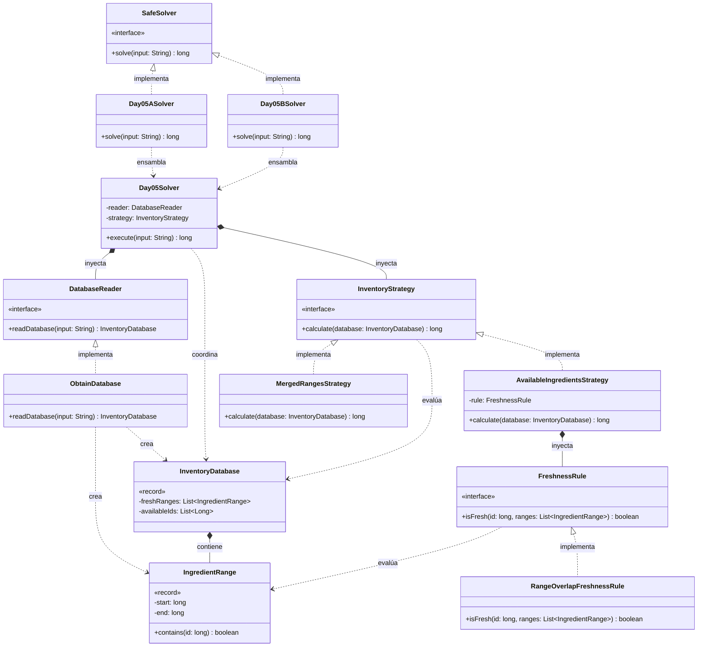

# Día 5: Cafeteria

## Descripción del Problema

El objetivo de este reto es ayudar a los Elfos a auditar su nuevo sistema de inventario en la cafetería para determinar qué ingredientes están frescos y cuáles están caducados. La base de datos proporciona una lista de rangos de IDs frescos y, separada por una línea en blanco, una lista de IDs de ingredientes disponibles a revisar.

*   **Parte A**: Un ingrediente se considera **fresco** si su ID recae dentro de *al menos uno* de los rangos proporcionados (los rangos son inclusivos y pueden superponerse). El objetivo es contar la cantidad total de ingredientes frescos dentro de nuestra lista de disponibles.
*   **Parte B**: *(La especificación se desbloqueará al completar la Parte A. La arquitectura está preparada para inyectar nuevas reglas de frescura o estrategias de optimización de rangos sin modificar el motor principal).*

---

## Explicación de las Relaciones y Elementos

*   **Implementación:** `Day05ASolver` implementa la interfaz `SafeSolver`, exponiendo así únicamente el método público `solve` hacia el exterior.
*   **Ensamblaje e Inyección:** El solver específico (`Day05ASolver`) instancia las dependencias correctas y se las inyecta al motor principal (`Day05Solver`), el cual ejecuta el algoritmo de forma agnóstica.
*   **Composición y Uso:** `Day05Solver` contiene a `DatabaseReader` y `FreshnessRule`, delegando en ellos. Los dominios se comunican utilizando los Records inmutables `InventoryDatabase` e `IngredientRange`.

---

## Arquitectura de Clases y Responsabilidades

- **Los Ensambladores y el Motor Principal:**
    *   `SafeSolver` **(Interfaz):** Contrato global del repositorio para la ejecución de cualquier día.
    *   `Day05ASolver` **(Clase):** Implementa `SafeSolver`. Configura las dependencias concretas para la Parte A y se las pasa al motor genérico.
    *   `Day05Solver` **(Clase):** Actúa como el motor principal agnóstico. Se limita a pedir la base de datos al lector y filtrar los ingredientes disponibles según la regla inyectada.
- **Dominio de Lectura (Abstracción y Value Objects):**
    *   `DatabaseReader` **(Interfaz):** Establece el contrato público para el parseo del archivo.
    *   `ObtainDatabase` **(Clase):** Implementa el contrato separando los rangos de los IDs disponibles y transformándolos en un objeto de dominio estructurado.
    *   `InventoryDatabase` **(Record):** *Value Object* inmutable que agrupa de forma segura los rangos y los IDs disponibles a procesar.
    *   `IngredientRange` **(Record):** *Value Object* que representa un rango `(start, end)`. Posee alta cohesión al incluir el método `contains(id)` para auto-evaluarse.
- **Dominio de Reglas (Polimorfismo):**
    *   `FreshnessRule` **(Interfaz):** Interfaz que define el contrato `isFresh(id, ranges)`, permitiendo inyectar diferentes criterios de validación.
    *   `RangeOverlapFreshnessRule` **(Clase):** Implementación concreta que verifica si un ID está presente en cualquier rango utilizando la evaluación de los *Value Objects*.

---

## Fundamentos y Principios de Diseño Aplicados

El diseño de esta solución garantiza la mantenibilidad del código basándose en fundamentos clave de la Ingeniería del Software:

*   **Principio de Responsabilidad Única (SRP):** `IngredientRange` es responsable exclusivamente de saber si un número recae en sus límites. `ObtainDatabase` solo sabe cómo parsear cadenas separadas por líneas en blanco. `Day05Solver` solo coordina el filtrado.
*   **Alta Cohesión (Information Expert):** Al delegar el cálculo `id >= start && id <= end` al propio `IngredientRange`, los datos y el comportamiento que opera sobre ellos residen en el mismo lugar, evitando un modelo de dominio anémico.
*   **Principio Abierto/Cerrado (OCP):** El diseño está preparado para inyectar una regla más compleja (por ejemplo, si en la Parte B los Elfos deciden que hay rangos "tóxicos" que anulan a los frescos) creando una nueva `FreshnessRule` sin modificar el `Day05Solver`.
*   **Bajo Acoplamiento e Inyección de Dependencias:** El motor principal ignora completamente cómo se leen los datos o cómo se evalúa la frescura, dependiendo únicamente de las abstracciones `DatabaseReader` y `FreshnessRule`.

