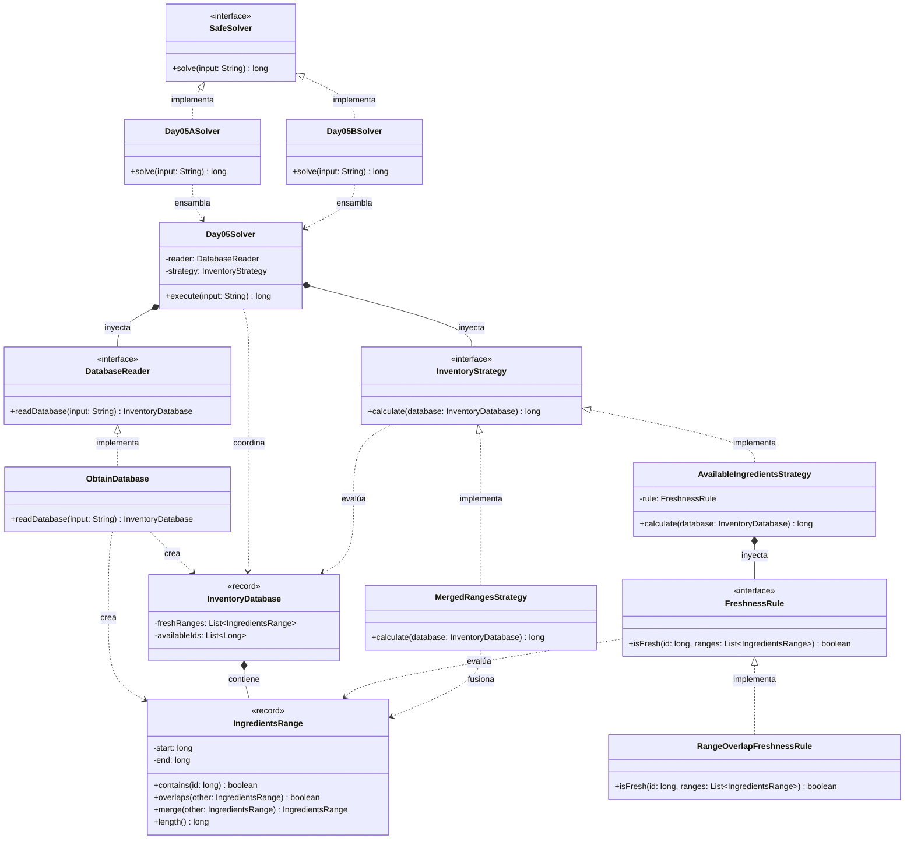

# Día 5: Cafeteria

## Descripción del Problema

Tras atravesar el muro, los Elfos necesitan ayuda para determinar qué ingredientes de su cafetería están frescos según una base de datos de rangos de IDs frescos. El input consta de dos bloques: una lista de rangos de IDs frescos (inclusivos y potencialmente solapados) y una lista de IDs de ingredientes disponibles.

*   **Parte A**: Determinar cuántos de los IDs de ingredientes **disponibles** son frescos, es decir, caen dentro de al menos uno de los rangos frescos.
*   **Parte B**: Ignorando la lista de IDs disponibles, determinar cuántos IDs en total son considerados frescos por la unión de todos los rangos frescos (teniendo en cuenta que se solapan y no deben contarse por duplicado).

---

## Explicación de las Relaciones y Elementos

*   **Implementación:** `Day05ASolver` y `Day05BSolver` implementan `SafeSolver`, exponiendo únicamente el método público `solve` hacia el exterior.
*   **Ensamblaje e Inyección:** Cada solver específico configura la `InventoryStrategy` correspondiente a su parte y se la inyecta, junto con el `DatabaseReader`, al motor genérico `Day05Solver`.
*   **Composición y Uso:** `Day05Solver` delega la ejecución completa en la estrategia inyectada, sin conocer si se trata de comprobar IDs disponibles o de fusionar rangos. Toda la lógica de comparación y fusión entre rangos vive en `IngredientsRange`, no en las estrategias que la consumen.

---

## Arquitectura de Clases y Responsabilidades

- **Los Ensambladores y el Motor Principal:**
  *   `SafeSolver` **(Interfaz):** Contrato global del repositorio para la ejecución de cualquier día.
  *   `Day05ASolver` / `Day05BSolver` **(Clases):** Implementan `SafeSolver`. Configuran la `InventoryStrategy` concreta para cada parte y se la pasan al motor genérico.
  *   `Day05Solver` **(Clase):** Motor agnóstico que lee el input y delega íntegramente en la `InventoryStrategy` inyectada.
- **Dominio de Lectura (Abstracción y Value Objects):**
  *   `DatabaseReader` **(Interfaz):** Contrato público para la extracción de la base de datos de rangos e IDs disponibles.
  *   `ObtainDatabase` **(Clase):** Implementa el contrato, parseando el input en un `InventoryDatabase` compuesto por `IngredientsRange`.
  *   `InventoryDatabase` **(Record):** *Value Object* que agrupa los rangos frescos y los IDs disponibles.
  *   `IngredientsRange` **(Record):** *Value Object* que representa un rango `[start, end]` inclusivo. No es un simple portador de datos: encapsula tanto la consulta de pertenencia (`contains`) como toda la lógica de comparación y combinación entre rangos (`overlaps`, `merge`, `length`), evitando que ese conocimiento se filtre a las estrategias que lo consumen.
- **Dominio de Estrategia (Polimorfismo):**
  *   `InventoryStrategy` **(Interfaz):** Contrato `calculate(database)` que permite inyectar el algoritmo completo de resolución sin acoplar `Day05Solver` a los detalles de cada parte.
  *   `AvailableIngredientsStrategy` **(Clase):** Implementación para la Parte A — recorre los IDs disponibles y cuenta cuántos son frescos, delegando el criterio de frescura en una `FreshnessRule` inyectada.
  *   `MergedRangesStrategy` **(Clase):** Implementación para la Parte B — ordena los rangos frescos y aplica un barrido lineal (sweep-line), delegando en `IngredientsRange` la decisión de si dos rangos se solapan (`overlaps`) y cómo fusionarlos (`merge`), y limitándose a acumular la longitud (`length`) de cada tramo consolidado.
- **Dominio de Reglas (Polimorfismo):**
  *   `FreshnessRule` **(Interfaz):** Contrato `isFresh(id, ranges)` que define el criterio de frescura de un ID frente a una colección de rangos.
  *   `RangeOverlapFreshnessRule` **(Clase):** Implementación concreta — un ID es fresco si algún rango de la lista lo contiene.

---

## Fundamentos y Principios de Diseño Aplicados

*   **Principio de Responsabilidad Única (SRP):** `IngredientsRange` concentra toda la lógica de comparación y fusión entre rangos; `FreshnessRule` decide el criterio de frescura; cada `InventoryStrategy` orquesta un algoritmo completo distinto; `Day05Solver` solo lee y delega.
*   **Encapsulación (Tell, Don't Ask):** `MergedRangesStrategy` no conoce ni manipula directamente los campos `start`/`end` de `IngredientsRange` — le pregunta si se solapa (`overlaps`) y le pide que se fusione (`merge`), en vez de extraer sus valores y recalcular la comparación fuera del objeto.
*   **Abstracción y Diseño por Contrato:** `DatabaseReader`, `InventoryStrategy` y `FreshnessRule` son interfaces pequeñas que ocultan los detalles de implementación tras un contrato explícito.
*   **Bajo Acoplamiento e Inyección de Dependencias:** `Day05Solver` no crea ninguna de sus dependencias; `AvailableIngredientsStrategy` tampoco crea su propia `FreshnessRule` — todo se inyecta desde los solvers concretos.
*   **Principio Abierto/Cerrado (OCP):** Añadir un nuevo criterio de frescura o un nuevo algoritmo de cálculo solo requiere una nueva implementación de `FreshnessRule` o `InventoryStrategy`, sin tocar `Day05Solver`. Del mismo modo, cualquier lógica adicional de combinación de rangos se extiende añadiendo métodos a `IngredientsRange`, sin tocar las estrategias que ya la consumen.
*   **Principio de Sustitución de Liskov (LSP):** Cualquier `InventoryStrategy` o `FreshnessRule` concreta puede sustituir a su contrato sin alterar el comportamiento esperado del resto del sistema.
*   **Inmutabilidad del Estado:** `InventoryDatabase` e `IngredientsRange` son records inmutables; `merge` siempre retorna una nueva instancia en vez de mutar ninguno de los dos rangos originales.

---

## Mecanismos del Lenguaje

*   **Records:** `InventoryDatabase` e `IngredientsRange` son portadores de datos inmutables; `IngredientsRange` añade comportamiento propio (`contains`, `overlaps`, `merge`, `length`) sobre sus campos, en vez de exponerlos para que se manipulen desde fuera.
*   **Polimorfismo (Upcasting):** Las estrategias e implementaciones concretas se manejan de forma genérica a través de sus interfaces (`InventoryStrategy`, `FreshnessRule`) en todo el flujo de orquestación.
*   **API de Streams / Comparator:** Útil tanto para el parseo del input (dos bloques separados por línea en blanco) como para el ordenamiento de rangos por posición inicial en `MergedRangesStrategy` (`Comparator.comparingLong`).