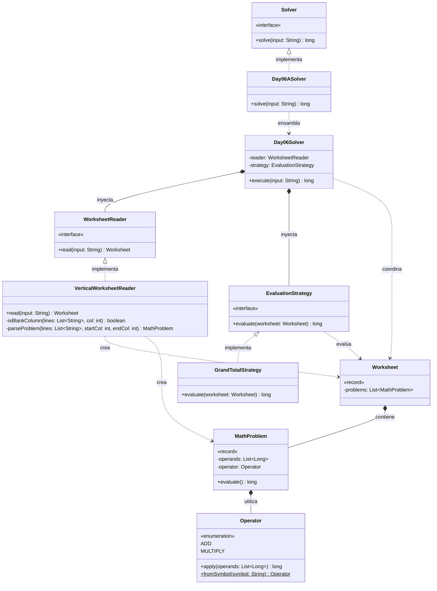

# Día 6: Trash Compactor

## Descripción del Problema

Tras caer por un conducto de basura, nos encontramos atrapados en un compactador sellado magnéticamente. Mientras una familia de cefalópodos intenta abrir la puerta, nos piden ayuda con los deberes de matemáticas de la más pequeña.

*   **Parte A**: Se nos proporciona una hoja de cálculo con problemas matemáticos. La particularidad es que los problemas están dispuestos horizontalmente, separados por columnas de espacios en blanco. Cada problema contiene una serie de números alineados verticalmente y, en la parte inferior, el símbolo de la operación a realizar (`+` o `*`). El objetivo es parsear este formato visual, resolver cada problema individualmente aplicando la operación a sus operandos, y calcular el **gran total** sumando todos los resultados.
*   **Parte B**: Los cefalópodos regresan y se dan cuenta de que su sistema matemático se lee de forma distinta: de derecha a izquierda por columnas, y los números se forman leyendo verticalmente (el dígito superior es el más significativo y el inferior el menos significativo). El operador sigue estando en la parte inferior del bloque. El objetivo es volver a parsear la hoja de cálculo con estas nuevas reglas y recalcular el gran total.

---

## Explicación de las Relaciones y Elementos

*   **Implementación:** `Day06ASolver` implementa la interfaz global `Solver`, exponiendo el método `solve` al exterior.
*   **Ensamblaje e Inyección:** El solver específico (`Day06ASolver`) se encarga de instanciar las dependencias correctas para la lectura del formato vertical y la estrategia de evaluación del total. Estas se inyectan en el motor principal (`Day06Solver`).
*   **Composición y Uso:** `Day06Solver` delega en `WorksheetReader` para la transformación del texto a objetos de dominio, y en `EvaluationStrategy` para la resolución matemática, desconociendo por completo las reglas de parseo o de cálculo.

---

## Arquitectura de Clases y Responsabilidades

- **Los Ensambladores y el Motor Principal:**
    *   `Solver` **(Interfaz):** Contrato global del repositorio.
    *   `Day06ASolver` **(Clase):** Implementa `Solver`. Configura e inyecta `VerticalWorksheetReader` y `GrandTotalStrategy` en el motor central.
    *   `Day06Solver` **(Clase):** Orquestador agnóstico. Lee el input y aplica la estrategia sobre el dominio resultante. No contiene lógica de negocio.
- **Dominio de Lectura y Modelado (Value Objects):**
    *   `WorksheetReader` **(Interfaz):** Contrato para el parseo de la entrada.
    *   `VerticalWorksheetReader` **(Clase):** Implementación concreta que procesa la cuadrícula de texto caracter a caracter, separando los bloques por columnas vacías para construir la hoja matemática.
    *   `Worksheet` **(Record):** *Value Object* inmutable que contiene la colección de problemas matemáticos.
    *   `MathProblem` **(Record):** Encapsula los operandos y el operador de un bloque concreto. Delega en el operador la ejecución de la operación, manteniéndose inmutable.
    *   `Operator` **(Enum):** Define las operaciones matemáticas soportadas (`ADD`, `MULTIPLY`) y contiene la lógica (mediante Streams y lambdas) para aplicarlas sobre una lista de números.
- **Dominio de Estrategia (Polimorfismo):**
    *   `EvaluationStrategy` **(Interfaz):** Define el contrato `evaluate(worksheet)` para procesar la colección de problemas.
    *   `GrandTotalStrategy` **(Clase):** Implementación para la Parte A. Calcula el resultado individual de cada `MathProblem` y los suma todos utilizando la API de Streams.

---

## Fundamentos y Principios de Diseño Aplicados

El diseño de esta solución garantiza la mantenibilidad del código basándose en fundamentos clave de la Ingeniería del Software:

*   **Principio de Responsabilidad Única (SRP):** El complejo parseo espacial del texto está completamente aislado en `VerticalWorksheetReader`. La resolución matemática pertenece en exclusiva a `Operator` y `GrandTotalStrategy`.
*   **Diseño basado en el Dominio (DDD):** Uso del enum `Operator` y los Records para dotar de semántica a los datos. Se evita el manejar listas de strings en bruto en las capas de lógica.
*   **Inyección de Dependencias y OCP:** El orquestador `Day06Solver` está cerrado a modificaciones. Si la Parte B cambia el formato de lectura o la forma de evaluar, solo crearemos nuevas implementaciones de `WorksheetReader` o `EvaluationStrategy`.
*   **Inmutabilidad:** Las listas internas de los Records y los resultados derivados nunca mutan estado externo, asegurando una evaluación predecible y segura.
---

## Mecanismos del Lenguaje

Para llegar a cabo esta arquitectura, se han empleado las siguientes características avanzadas de Java:

*   **Polimorfismo (Upcasting):** Las instancias de tipos específicos se asignan de forma automática y segura a variables de supertipo, permitiendo trabajar con los objetos de manera genérica.
*   **API de Streams:** Se utiliza para el procesamiento declarativo, facilitando el clonado y modificación de colecciones (como la copia profunda de filas en el grid) de forma limpia y funcional.
*   **Records:** Entidades puramente portadoras de datos que se encapsulan de forma inmutable, actuando como escudo protector. `Position` aporta significado semántico a las coordenadas del grid, mientras que `PaperGrid` maneja internamente los límites de la matriz evitando `IndexOutOfBoundsException`.
