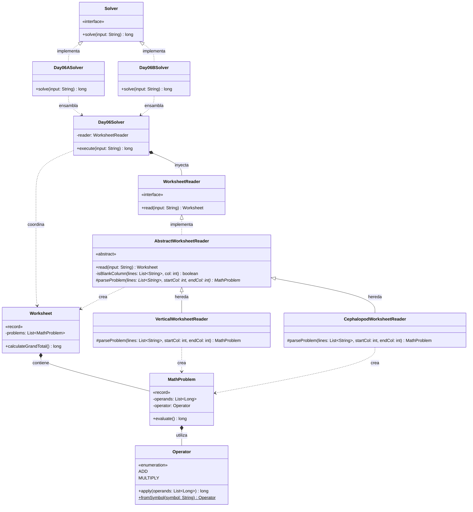

# Día 6: Trash Compactor

## Descripción del Problema

Tras caer accidentalmente por un conducto de basura, quedamos atrapados en un compactador sellado. Una familia de cefalópodos nos pide ayuda con los deberes de matemáticas de la más pequeña mientras intentan abrir la puerta. El input es una hoja de cálculo (tu puzzle input) con varios problemas matemáticos dispuestos horizontalmente, separados entre sí por columnas de espacios en blanco.

*   **Parte A**: Cada problema tiene sus operandos escritos horizontalmente, uno debajo del otro, con el operador (`+` o `*`) en la fila inferior. Hay que parsear la hoja línea por línea, resolver cada problema aplicando su operador a sus operandos, y sumar todos los resultados para obtener el **gran total**.
*   **Parte B**: Los cefalópodos aclaran que su notación se lee de derecha a izquierda, columna a columna: cada número se forma leyendo sus dígitos verticalmente (el de arriba es el más significativo), y el orden de los problemas se invierte. El operador sigue en la fila inferior de cada bloque. Hay que volver a parsear la misma hoja con estas reglas y recalcular el gran total.

---

## Explicación de las Relaciones y Elementos

*   **Implementación:** `Day06ASolver` y `Day06BSolver` implementan la interfaz global `Solver`, exponiendo únicamente el método público `solve` hacia el exterior.
*   **Ensamblaje e Inyección:** Cada solver específico instancia el `WorksheetReader` concreto correspondiente a su forma de lectura (`VerticalWorksheetReader` para la Parte A, `CephalopodWorksheetReader` para la Parte B) y lo inyecta en el motor principal `Day06Solver`.
*   **Composición y Uso:** `Day06Solver` delega por completo en `WorksheetReader` la transformación del texto en un `Worksheet`, y el propio `Worksheet` es responsable de calcularse a sí mismo el gran total — el orquestador no conoce ni las reglas de parseo ni el algoritmo de evaluación.
*   **Nota de diseño:** a diferencia de días anteriores, aquí **no existe una estrategia de evaluación independiente**. La operación de "sumar los resultados de cada problema" es idéntica entre la Parte A y la Parte B; lo único que varía entre ambas es *cómo se interpreta el texto de la hoja*. Por eso toda la variación del ejercicio se concentra en `WorksheetReader`, evitando introducir una abstracción adicional que no aportaría ningún punto de extensión real.

---

## Arquitectura de Clases y Responsabilidades

- **Los Ensambladores y el Motor Principal:**
  *   `Solver` **(Interfaz):** Contrato global del repositorio para la ejecución de cualquier día.
  *   `Day06ASolver` **(Clase):** Implementa `Solver`. Configura e inyecta un `VerticalWorksheetReader` en el motor central.
  *   `Day06BSolver` **(Clase):** Implementa `Solver`. Configura e inyecta un `CephalopodWorksheetReader` en el mismo motor, reutilizando toda la lógica de evaluación sin cambio alguno.
  *   `Day06Solver` **(Clase):** Orquestador agnóstico. Lee el input a través del `WorksheetReader` inyectado y delega en el `Worksheet` resultante el cálculo del gran total. No contiene lógica de negocio.
- **Dominio de Lectura y Modelado (Value Objects):**
  *   `WorksheetReader` **(Interfaz):** Contrato para el parseo de la entrada.
  *   `AbstractWorksheetReader` **(Clase abstracta):** Implementa el esqueleto común del algoritmo (Template Method) — detecta las columnas separadoras en blanco y trocea la hoja en bloques —, delegando en las subclases el único paso que difiere entre partes: interpretar los dígitos de cada bloque (`parseProblem`).
  *   `VerticalWorksheetReader` **(Clase):** Extiende `AbstractWorksheetReader`. Interpreta cada bloque leyendo los operandos horizontalmente, tal como se presentan en la hoja (Parte A).
  *   `CephalopodWorksheetReader` **(Clase):** Extiende `AbstractWorksheetReader`. Interpreta cada bloque leyendo los dígitos verticalmente por columna (dígito más significativo arriba) y en orden inverso de problemas (Parte B).
  *   `Worksheet` **(Record):** *Value Object* inmutable que contiene la colección de problemas matemáticos y expone `calculateGrandTotal()`, delegando en cada `MathProblem` su propia evaluación.
  *   `MathProblem` **(Record):** Encapsula los operandos y el operador de un bloque concreto. Delega en `Operator` la ejecución de la operación, manteniéndose inmutable.
  *   `Operator` **(Enum):** Define las operaciones soportadas (`ADD`, `MULTIPLY`) junto con la lógica para aplicarlas sobre una lista de operandos, y un factory estático `fromSymbol` para convertir el símbolo textual (`+`/`*`) del input en el valor del enum correspondiente.

---

## Fundamentos y Principios de Diseño Aplicados

*   **Principio de Responsabilidad Única (SRP):** El complejo parseo espacial del texto está aislado en las implementaciones de `WorksheetReader`; la resolución matemática pertenece en exclusiva a `Operator` y `MathProblem`; `Worksheet` solo agrega y totaliza.
*   **Template Method:** `AbstractWorksheetReader` fija el algoritmo común de troceado de la hoja y delega en las subclases el único paso variable — cómo interpretar los dígitos de un bloque —, evitando duplicar la lógica de detección de columnas en blanco entre `VerticalWorksheetReader` y `CephalopodWorksheetReader`.
*   **Tell, Don't Ask:** `Worksheet` no expone su lista interna de problemas para que el orquestador la recorra; se pregunta a sí mismo el gran total (`calculateGrandTotal()`), igual que `MathProblem` se evalúa a sí mismo (`evaluate()`).
*   **Diseño basado en el Dominio (DDD):** Uso del enum `Operator` y los Records para dotar de semántica a los datos, evitando manejar listas de strings en bruto en las capas de lógica.
*   **Inyección de Dependencias y OCP:** El orquestador `Day06Solver` está cerrado a modificaciones. Si se necesitara un tercer formato de lectura, bastaría con una nueva subclase de `AbstractWorksheetReader`, sin tocar `Day06Solver` ni el resto del dominio.
*   **Inmutabilidad:** `Worksheet` y `MathProblem` son records inmutables; ninguna operación de evaluación muta su estado interno.

---

## Mecanismos del Lenguaje

*   **Clases Abstractas y Template Method:** `AbstractWorksheetReader` combina un método concreto (`read`) que orquesta el algoritmo con un método abstracto protegido (`parseProblem`) que las subclases deben completar.
*   **Polimorfismo (Upcasting):** `Day06Solver` trabaja con `WorksheetReader` de forma genérica, sin conocer si la instancia concreta es `VerticalWorksheetReader` o `CephalopodWorksheetReader`.
*   **API de Streams:** Se utiliza para el procesamiento declarativo, tanto en `Operator.apply()` para reducir la lista de operandos como en `Worksheet.calculateGrandTotal()` para sumar los resultados de todos los problemas.
*   **Enums con comportamiento:** `Operator` no es un simple marcador — encapsula tanto la operación matemática como su factory de parseo (`fromSymbol`), evitando condicionales `if/else` sobre el símbolo textual en el resto del código.