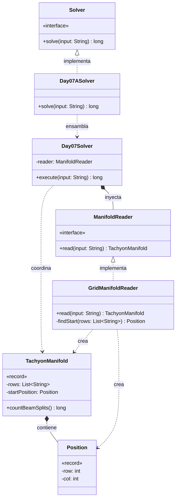

# Día 7: Laboratories

## Descripción del Problema

Buscando una forma de salir del laboratorio, activamos un teletransportador que resulta estar averiado por culpa de una fuga de taquiones en su colector (manifold). Nos proporcionan un mapa del colector, que es una cuadrícula 2D por donde desciende un rayo de taquiones desde el punto de inicio `S`.

*   **Parte A**: El rayo siempre avanza hacia abajo. Atraviesa el espacio vacío (`.`) sin inmutarse, pero si choca contra un separador (`^`), el rayo original se detiene y genera **dos nuevos rayos** que continúan desde las posiciones inmediatamente a la izquierda y a la derecha del separador. Si dos rayos convergen en la misma celda de espacio vacío, se fusionan en uno solo. El objetivo es simular la caída de los rayos hasta que salgan del colector y contar el número total de veces que se ha producido una división (cuántos `^` han sido impactados).
*   **Parte B**: *(Pendiente de ser revelada)*.

---

## Explicación de las Relaciones y Elementos

*   **Implementación:** `Day07ASolver` implementa la interfaz global `Solver` (o `SafeSolver`), ocultando la complejidad de instanciación del exterior.
*   **Ensamblaje e Inyección:** El solver inyecta la implementación `GridManifoldReader` en el motor central `Day07Solver`.
*   **Composición y Uso:** `Day07Solver` delega la lectura en el reader, y posteriormente le pide al propio modelo resultante (`TachyonManifold`) que ejecute su lógica de negocio y devuelva el total de divisiones.
*   **Nota de diseño:** En línea con la simplificación lograda en el Día 6, se ha evitado crear una clase `SimulationStrategy` o similar. El comportamiento de "contar divisiones simulando la caída" es intrínseco al colector de taquiones. Si la Parte B altera las leyes físicas, evaluaremos extraer la simulación a un patrón *Strategy*; pero por ahora aplicamos *YAGNI*.

---

## Arquitectura de Clases y Responsabilidades

- **Los Ensambladores y el Motor Principal:**
    *   `Solver` **(Interfaz):** Contrato global del repositorio.
    *   `Day07ASolver` **(Clase):** Ensamblador específico de la Parte A.
    *   `Day07Solver` **(Clase):** Orquestador agnóstico.
- **Dominio de Lectura y Modelado (Value Objects):**
    *   `ManifoldReader` **(Interfaz):** Define el contrato de parseo.
    *   `GridManifoldReader` **(Clase):** Transforma la entrada de texto plano en la estructura de dominio `TachyonManifold`, localizando de paso la coordenada `S`.
    *   `TachyonManifold` **(Record):** *Value Object* inmutable que contiene la matriz del colector y el punto de inicio. Posee un Modelo Rico (DDD), exponiendo la operación `countBeamSplits()`. Utiliza internamente un `HashSet` para procesar los rayos fila por fila, resolviendo mágicamente las colisiones y fusiones (ya que un `Set` no permite columnas duplicadas).
    *   `Position` **(Record):** Encapsula las coordenadas `(row, col)`, eliminando el uso de primitivos sin contexto semántico.

