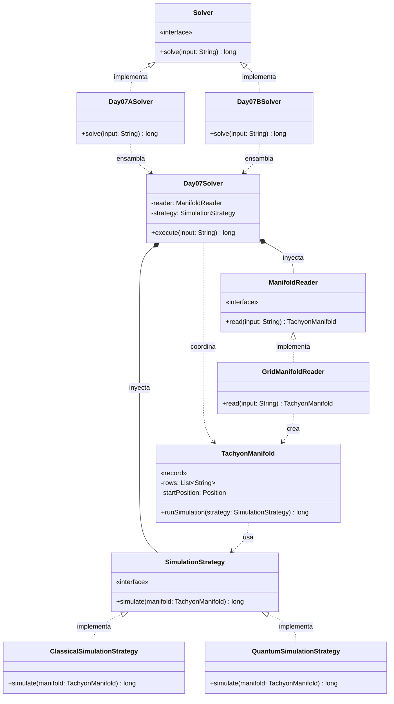

# Día 7: Laboratories

## Descripción del Problema

Buscando una forma de salir del laboratorio, activamos un teletransportador que resulta estar averiado. Nos proporcionan un mapa del colector de taquiones, una cuadrícula por donde descienden los rayos desde el punto `S`.

*   **Parte A**: (Física Clásica). El rayo siempre avanza hacia abajo. Atraviesa el espacio vacío (`.`), pero si choca contra un separador (`^`), se divide en dos nuevos rayos (izquierda y derecha). Si dos rayos convergen en el mismo espacio vacío, se fusionan en uno solo. Hay que simular la caída y contar **cuántas veces un rayo impactó un separador**.
*   **Parte B**: (Física Cuántica). Descubrimos que el colector es cuántico. Solo se envía una partícula, y la interpretación de los Muchos Mundos nos dice que los rayos *no se fusionan*. Cada vez que una partícula choca con un `^`, la línea temporal se divide en dos universos paralelos (uno donde fue a la izquierda, otro a la derecha). Hay que calcular el **número total de líneas temporales** (partículas) resultantes tras atravesar todo el colector.

---

## Explicación de las Relaciones y Elementos

Tal y como predijimos en la Parte A, la Parte B ha alterado las leyes físicas del problema. Esto nos obliga a abandonar nuestra postura inicial *YAGNI* (You Aren't Gonna Need It) y extraer la lógica de simulación a un patrón **Strategy**, aislando el comportamiento clásico del cuántico.

*   **Ensamblaje e Inyección:** `Day07ASolver` y `Day07BSolver` instancian la estrategia física correspondiente (`ClassicalSimulationStrategy` o `QuantumSimulationStrategy`) junto con el lector, y se las inyectan al motor central `Day07Solver`.
*   **Composición y Uso:** `Day07Solver` lee el `TachyonManifold` y delega en la `SimulationStrategy` inyectada la resolución del problema. El modelo sigue siendo rico al permitir inyectar el motor físico en su método `runSimulation(strategy)`.

---

## Arquitectura de Clases y Responsabilidades

- **Los Ensambladores y el Motor Principal:**
  *   `Solver` **(Interfaz):** Contrato global del repositorio.
  *   `Day07ASolver` / `Day07BSolver` **(Clases):** Ensamblan la lectura y la estrategia física (Clásica o Cuántica) correspondientes a cada parte.
  *   `Day07Solver` **(Clase):** Orquestador agnóstico.
- **Dominio de Simulación (Patrón Strategy):**
  *   `SimulationStrategy` **(Interfaz):** Contrato para inyectar las leyes de la física `simulate(manifold)`.
  *   `ClassicalSimulationStrategy` **(Clase):** Implementa la Parte A. Usa un `Set` para rastrear las posiciones activas, fusionando automáticamente las convergencias por la propiedad de unicidad matemática del conjunto.
  *   `QuantumSimulationStrategy` **(Clase):** Implementa la Parte B. Usa un `Map<Integer, Long>` para rastrear la *cantidad* de partículas en cada columna, multiplicando las líneas temporales en cada divisor sin fusionarlas.
- **Dominio de Lectura y Modelado:**
  *   `ManifoldReader` y `GridManifoldReader`: Parsean la cuadrícula y localizan la `S`.
  *   `TachyonManifold` **(Record):** *Value Object* inmutable que contiene la matriz del colector. Delega la ejecución a la estrategia mediante `runSimulation()`.

