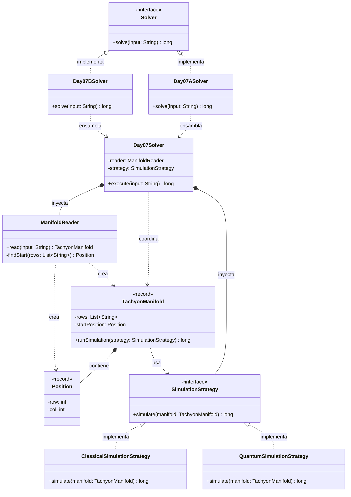

# Día 7: Laboratories

## Descripción del Problema

Tras salir del compactador de basura, llegamos a un ala de investigación del Polo Norte centrada en teleportación. Al usar el teleportador quedamos atrapados en una sala sin puertas, y un diagnóstico revela un fallo en uno de los manifolds de taquiones. El input es el diagrama de dicho manifold: una cuadrícula donde `S` marca el punto de entrada del haz, `.` es espacio vacío por el que el haz avanza libremente hacia abajo, y `^` es un splitter que detiene el haz que lo alcanza y genera dos nuevos haces, uno inmediatamente a su izquierda y otro a su derecha.

*   **Parte A**: Simular el recorrido clásico del haz de taquiones a través del manifold y contar **cuántas veces se divide** el haz al encontrar splitters.
*   **Parte B**: Reinterpretar la simulación bajo la óptica de universos múltiples: en vez de contar divisiones de un haz físico, cada splitter representa una bifurcación temporal (la partícula fue a la izquierda en una línea temporal y a la derecha en otra). El objetivo es calcular el **número total de líneas temporales** activas al final del recorrido completo.

---

## Explicación de las Relaciones y Elementos

*   **Implementación:** `Day07ASolver` y `Day07BSolver` implementan `Solver`, exponiendo únicamente el método público `solve` hacia el exterior.
*   **Ensamblaje e Inyección:** Cada solver específico inyecta la misma dependencia de lectura (`ManifoldReader`) junto con la `SimulationStrategy` correspondiente a su parte (`ClassicalSimulationStrategy` para la Parte A, `QuantumSimulationStrategy` para la Parte B) en el motor genérico `Day07Solver`.
*   **Composición y Uso:** `Day07Solver` delega la lectura del input en `ManifoldReader` y la ejecución completa del algoritmo en la `SimulationStrategy` inyectada. El propio `TachyonManifold` es quien se somete a la simulación (`runSimulation`), en vez de que el orquestador recorra su estructura interna directamente.
*   **Nota de diseño (YAGNI):** a diferencia de días anteriores, `ManifoldReader` es una clase concreta, sin interfaz de por medio. No hay ningún indicio en el enunciado de que vaya a existir un segundo formato de manifold que requiera una lectura alternativa, así que introducir una abstracción `ManifoldReader`/`ObtainManifold` solo añadiría indirección sin ningún punto de extensión real. El único eje de variación genuino de este día es el algoritmo de simulación, y ahí sí se aplica polimorfismo real vía `SimulationStrategy`.

---

## Arquitectura de Clases y Responsabilidades

- **Los Ensambladores y el Motor Principal:**
  *   `Solver` **(Interfaz):** Contrato global del repositorio para la ejecución de cualquier día.
  *   `Day07ASolver` **(Clase):** Implementa `Solver`. Configura e inyecta `ClassicalSimulationStrategy` en el motor central.
  *   `Day07BSolver` **(Clase):** Implementa `Solver`. Configura e inyecta `QuantumSimulationStrategy` en el mismo motor, reutilizando por completo la lectura y el modelo de dominio.
  *   `Day07Solver` **(Clase):** Orquestador agnóstico. Lee el input a través de `ManifoldReader` y delega en el `TachyonManifold` resultante la ejecución de la estrategia inyectada. No conoce las reglas de propagación ni de bifurcación de los haces.
- **Dominio de Lectura y Modelado (Value Objects):**
  *   `ManifoldReader` **(Clase):** Responsable de parsear el texto de entrada en un `TachyonManifold`, localizando además la posición inicial del haz (`findStart`). Se mantiene como clase concreta deliberadamente: no hay una segunda forma de leer el input que justifique una interfaz.
  *   `TachyonManifold` **(Record):** *Value Object* inmutable que representa la cuadrícula completa del manifold junto con su posición de entrada (`startPosition`). Se somete a sí mismo a una simulación (`runSimulation`) delegando el algoritmo concreto en la estrategia recibida, sin exponer su representación interna al resto del sistema.
  *   `Position` **(Record):** *Value Object* que representa una coordenada `(row, col)` dentro de la cuadrícula, evitando pares de enteros sueltos tanto en `ManifoldReader` como en las estrategias de simulación.
- **Dominio de Estrategia (Polimorfismo):**
  *   `SimulationStrategy` **(Interfaz):** Contrato `simulate(manifold)` que permite inyectar el algoritmo completo de recorrido del manifold sin acoplar `Day07Solver` ni `TachyonManifold` a los detalles de cada parte.
  *   `ClassicalSimulationStrategy` **(Clase):** Implementación para la Parte A — propaga el haz clásico a través de los splitters y cuenta el número total de divisiones producidas.
  *   `QuantumSimulationStrategy` **(Clase):** Implementación para la Parte B — aplica la interpretación de universos múltiples, contando el número de líneas temporales resultantes en vez de divisiones físicas del haz.

---

## Fundamentos y Principios de Diseño Aplicados

*   **Principio de Responsabilidad Única (SRP):** `ManifoldReader` solo parsea el input; `TachyonManifold` representa el estado del manifold; cada `SimulationStrategy` encapsula un algoritmo de recorrido completo y distinto; `Day07Solver` solo orquesta.
*   **Strategy Pattern:** La diferencia sustancial entre la Parte A (contar divisiones de un haz físico) y la Parte B (contar líneas temporales bajo la interpretación de universos múltiples) se resuelve inyectando una `SimulationStrategy` distinta, sin duplicar la lógica de recorrido de la cuadrícula ni condicionar el comportamiento con banderas o `if`s.
*   **YAGNI:** `ManifoldReader` no se abstrae tras una interfaz porque no existe ninguna variación real que la justifique en este ejercicio — a diferencia de la simulación, donde el polimorfismo sí resuelve un problema concreto del enunciado. Introducir una interfaz sin un segundo implementador sería indirección especulativa, no un beneficio de diseño.
*   **Tell, Don't Ask:** `TachyonManifold` no expone su cuadrícula interna (`rows`) para que la estrategia la recorra desde fuera con acceso directo; se somete a sí mismo a la simulación (`runSimulation(strategy)`), delegando el algoritmo concreto pero manteniendo el control de su propia representación.
*   **Value Objects e Inmutabilidad:** `TachyonManifold` y `Position` son records inmutables — ninguna operación de simulación altera el estado del manifold original.
*   **Inyección de Dependencias y OCP:** `Day07Solver` no crea `ManifoldReader` ni `SimulationStrategy`; ambos se inyectan desde los solvers concretos. Añadir una hipotética tercera interpretación de la simulación solo requeriría una nueva implementación de `SimulationStrategy`, sin modificar `Day07Solver` ni `TachyonManifold`.
*   **Principio de Sustitución de Liskov (LSP):** Cualquier `SimulationStrategy` concreta puede sustituir a su contrato sin alterar el comportamiento esperado del resto del sistema.

---

## Mecanismos del Lenguaje

*   **Records:** `TachyonManifold` y `Position` son portadores de datos inmutables; `Position` aporta significado semántico a las coordenadas de la cuadrícula, evitando pares de enteros sueltos en las firmas de `ManifoldReader` y `SimulationStrategy`.
*   **Polimorfismo (Upcasting):** `Day07Solver` y `TachyonManifold` trabajan con `SimulationStrategy` de forma genérica, sin conocer si la instancia concreta es `ClassicalSimulationStrategy` o `QuantumSimulationStrategy`.
*   **API de Streams:** Útil tanto para el parseo de la cuadrícula de texto en `ManifoldReader` como para el procesamiento declarativo de posiciones dentro de cada estrategia de simulación.