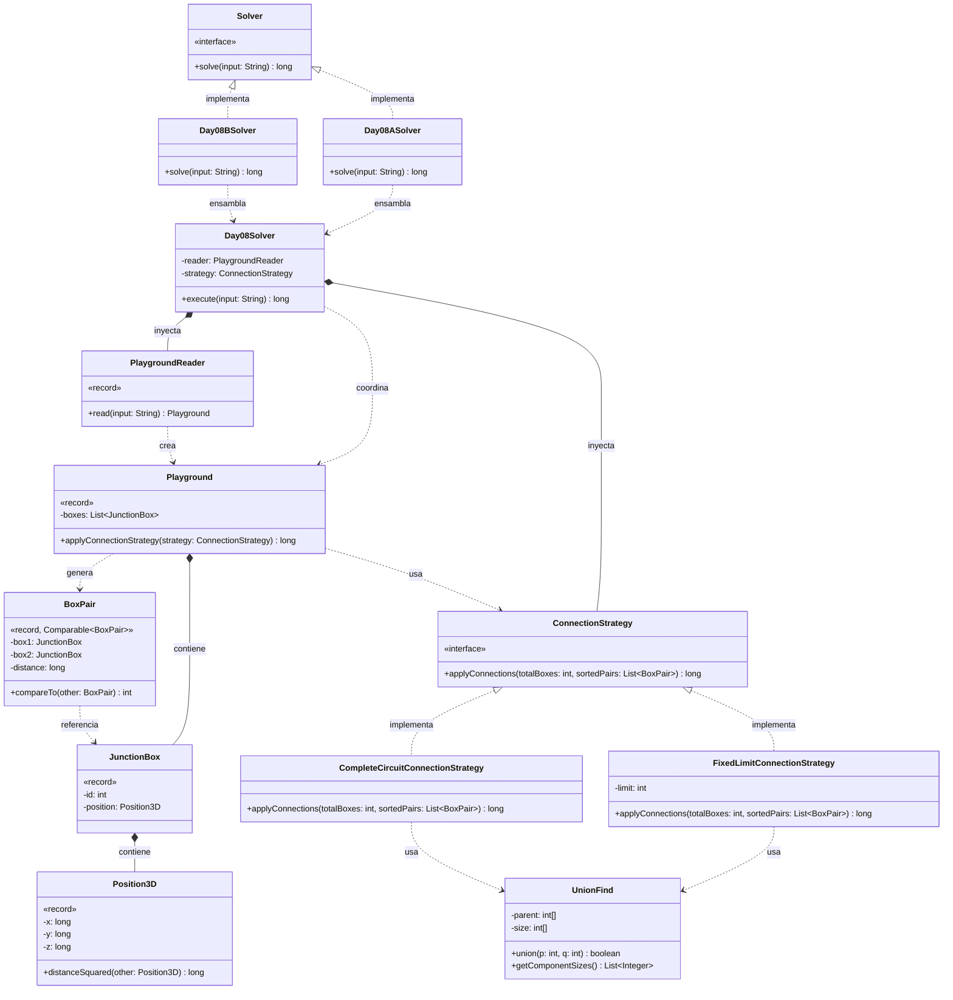

# Día 8: Playground

## Descripción del Problema

Tras salir del laboratorio, llegamos a un patio de juegos subterráneo donde los Elfos están cableando cajas de conexiones eléctricas para el proyecto navideño. El input es una lista de coordenadas 3D (X, Y, Z) que representan la posición de cada caja de conexiones.

*   **Parte A**: Conectar las cajas priorizando siempre los pares con menor distancia en línea recta entre sí. Si dos cajas ya pertenecen al mismo circuito (conectadas indirectamente), intentar unirlas no tiene efecto, pero cuenta igualmente como un intento. Hay que procesar los **1000 pares más cercanos** y, al terminar, multiplicar entre sí el tamaño de los **tres circuitos más grandes**.
*   **Parte B**: Continuar conectando los pares más cercanos sin límite, hasta que **todas** las cajas formen un único circuito. El resultado pedido no es un tamaño de circuito, sino el **producto de las coordenadas X** de las dos cajas de la conexión que finalmente unifica todo el sistema.

---

## Explicación de las Relaciones y Elementos

*   **Implementación:** `Day08ASolver` y `Day08BSolver` implementan `Solver`, exponiendo únicamente el método público `solve` hacia el exterior.
*   **Ensamblaje e Inyección:** Anticipando que la Parte B cambiaría el criterio de parada (conectar *todas* las cajas hasta formar un único circuito, en vez de un número fijo de pares), se introdujo desde el principio la interfaz `ConnectionStrategy`. El enunciado confirmó esa sospecha: la Parte B necesita exactamente ese criterio de parada distinto, y ha bastado con añadir `CompleteCircuitConnectionStrategy` sin tocar ni `Day08Solver` ni `Playground`. `Day08ASolver` inyecta `FixedLimitConnectionStrategy` (con el límite de 1000 pares configurable por constructor); `Day08BSolver` inyecta `CompleteCircuitConnectionStrategy`. Ambos comparten el mismo `PlaygroundReader`.
*   **Composición y Uso (Tell, Don't Ask):** `Day08Solver` delega en `PlaygroundReader` la creación del `Playground`, y no extrae las cajas para procesarlas él mismo — le pide al propio `Playground` que se resuelva a sí mismo: `applyConnectionStrategy(strategy)`. Internamente, `Playground` es responsable de generar las combinaciones de pares (`BoxPair`), ordenarlas por distancia, y entregárselas a la estrategia inyectada, sin ceder el control de su colección interna de `JunctionBox`.

---

## Arquitectura de Clases y Responsabilidades

- **Los Ensambladores y el Motor Principal:**
  *   `Solver` **(Interfaz):** Contrato global del repositorio para la ejecución de cualquier día.
  *   `Day08ASolver` **(Clase):** Implementa `Solver`. Inyecta `FixedLimitConnectionStrategy` (1000 pares por defecto, configurable por constructor) y `PlaygroundReader` en el motor central.
  *   `Day08BSolver` **(Clase):** Implementa `Solver`. Inyecta `CompleteCircuitConnectionStrategy` en el mismo motor, reutilizando por completo la lectura y el modelo de dominio.
  *   `Day08Solver` **(Clase):** Orquestador agnóstico. Lee el input a través de `PlaygroundReader` y delega en el `Playground` resultante la ejecución de la estrategia inyectada.
- **Dominio de Lectura y Modelado (Value Objects):**
  *   `PlaygroundReader` **(Clase):** Transforma la entrada de texto plano en un `Playground`. Se mantiene como clase concreta sin interfaz (YAGNI): no hay ningún indicio en el enunciado de un segundo formato de entrada que justifique abstraerla, igual que se decidió con `ManifoldReader` en el día 7.
  *   `Playground` **(Record):** *Value Object* inmutable que contiene la colección de `JunctionBox`. Expone `applyConnectionStrategy(strategy)`, generando internamente las combinaciones de pares, ordenándolas por distancia y entregándoselas a la estrategia, sin exponer su colección interna.
  *   `JunctionBox` **(Record):** Representa una caja de conexión con un identificador único y su posición en el espacio.
  *   `Position3D` **(Record):** Encapsula las coordenadas `(x, y, z)` y la lógica espacial `distanceSquared`. Se usa distancia al cuadrado en vez de distancia euclídea real: para ordenar pares por cercanía no hace falta la raíz cuadrada (es una transformación monótona que preserva el orden), y evitarla mantiene el cálculo en aritmética entera exacta con `long`, sin introducir errores de precisión de punto flotante.
  *   `BoxPair` **(Record):** Representa una arista del grafo entre dos `JunctionBox`, junto con su distancia. Implementa `Comparable<BoxPair>` para poder ordenarse por distancia de forma natural con `Collections.sort`/`Stream.sorted()`, sin necesitar un `Comparator` externo.
- **Dominio de Conexión (Patrón Strategy):**
  *   `ConnectionStrategy` **(Interfaz):** Contrato `applyConnections(totalBoxes, sortedPairs)` que aísla por completo las reglas de parada y de formación de circuitos, permitiendo inyectar el algoritmo sin acoplar `Playground` a los detalles de cada parte.
  *   `FixedLimitConnectionStrategy` **(Clase):** Implementación para la Parte A. Procesa únicamente los primeros `limit` pares de la lista ordenada, usa `UnionFind` para fusionar circuitos, y devuelve el producto de los tamaños de los tres circuitos más grandes al finalizar.
  *   `CompleteCircuitConnectionStrategy` **(Clase):** Implementación para la Parte B. Recorre los pares ordenados fusionándolos con `UnionFind` hasta que todas las cajas quedan en un único circuito, y devuelve el producto de las coordenadas X de las dos cajas de la conexión que provoca esa unificación final.
  *   `UnionFind` **(Clase):** Estructura de Conjuntos Disjuntos (Union-Find) usada internamente por ambas estrategias para rastrear a qué circuito pertenece cada caja y fusionar circuitos en tiempo casi constante (O(α(N))). Es una estructura algorítmica de bajo nivel, deliberadamente al margen del modelado de dominio (usa arrays primitivos `int[]` en vez de records), ya que su propósito es puramente de eficiencia interna y queda completamente oculta tras `union()`/`getComponentSizes()`.

---

## Fundamentos y Principios de Diseño Aplicados

*   **Principio de Responsabilidad Única (SRP):** `Position3D` calcula distancias; `BoxPair` representa una arista ordenable; `Playground` genera y ordena combinaciones; `UnionFind` rastrea circuitos; cada `ConnectionStrategy` decide cuándo parar y qué devolver. Ninguna clase mezcla más de una de estas responsabilidades.
*   **Strategy Pattern anticipado correctamente:** la interfaz `ConnectionStrategy` se introdujo antes de conocer el enunciado completo de la Parte B, previendo que el criterio de parada cambiaría. El enunciado confirmó esa previsión, y añadir `CompleteCircuitConnectionStrategy` no requirió modificar ni `Day08Solver` ni `Playground` — validación práctica del principio Abierto/Cerrado.
*   **Tell, Don't Ask:** `Playground` no expone su lista de `JunctionBox` para que la estrategia genere los pares desde fuera; genera y ordena los `BoxPair` internamente y solo entrega el resultado ya preparado a la estrategia.
*   **YAGNI:** `PlaygroundReader` se mantiene como clase concreta sin interfaz, igual que `ManifoldReader` en el día 7 — no hay una segunda forma de leer el input que lo justifique.
*   **Encapsulación de la eficiencia algorítmica:** `UnionFind` usa arrays primitivos en vez de records inmutables deliberadamente. Es una estructura interna de un solo uso, orientada a rendimiento (O(α(N)) por fusión), y su representación nunca se filtra fuera de la clase — las estrategias solo ven `union()` y `getComponentSizes()`.
*   **Inmutabilidad y precisión numérica:** `Position3D.distanceSquared` evita la raíz cuadrada tanto por rendimiento como por corrección: al comparar únicamente para ordenar, la distancia al cuadrado preserva el mismo orden relativo que la distancia real, evitando además la pérdida de precisión de trabajar con `double`.
*   **Inyección de Dependencias:** `Day08Solver` no crea ni `PlaygroundReader` ni `ConnectionStrategy` — ambos se inyectan desde los solvers concretos.
*   **Principio de Sustitución de Liskov (LSP):** Cualquier `ConnectionStrategy` concreta puede sustituir a su contrato sin alterar el comportamiento esperado del resto del sistema, a pesar de que ambas implementaciones devuelven magnitudes conceptualmente distintas (producto de tamaños vs. producto de coordenadas) — el contrato `long applyConnections(...)` es suficientemente genérico para ambos casos.

---

## Mecanismos del Lenguaje

*   **Records e Interfaces funcionales del JDK:** `BoxPair` implementa `Comparable<BoxPair>`, permitiendo ordenar la lista de pares con `Collections.sort()` o `Stream.sorted()` sin necesidad de un `Comparator` externo.
*   **Polimorfismo (Upcasting):** `Day08Solver` y `Playground` trabajan con `ConnectionStrategy` de forma genérica, sin conocer si la instancia concreta es `FixedLimitConnectionStrategy` o `CompleteCircuitConnectionStrategy`.
*   **API de Streams:** Útil tanto para generar todas las combinaciones de pares de cajas en `Playground` como para transformar los resultados de `UnionFind.getComponentSizes()` al calcular el producto de los circuitos más grandes.
*   **Estructuras de datos de bajo nivel (Union-Find):** `UnionFind` implementa *path compression* y *union by size* sobre arrays primitivos, priorizando el rendimiento en un algoritmo que se ejecuta miles de veces sobre el conjunto de pares.