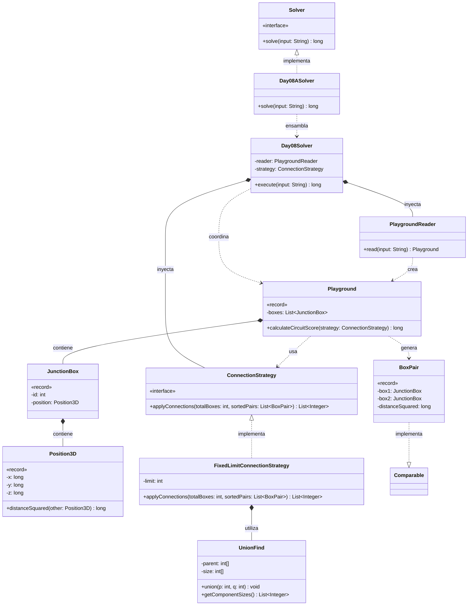

# Día 8: Playground

## Descripción del Problema

Tras salir del laboratorio cuántico, nos encontramos en un inmenso patio de juegos subterráneo donde los elfos están colgando cajas de conexiones eléctricas. Nuestro objetivo es ayudarles a cablear el circuito navideño utilizando la menor cantidad de cable posible.

*   **Parte A**: Se nos proporciona una lista de coordenadas 3D (X, Y, Z) correspondientes a las cajas de conexiones. La regla es conectar las cajas priorizando siempre los pares que tengan la menor distancia en línea recta entre sí. Si dos cajas ya están conectadas indirectamente (pertenecen al mismo circuito), intentar unirlas no tiene ningún efecto, pero cuenta como un "intento de conexión". Debemos procesar los **1000 pares más cercanos**. Una vez hecho esto, el objetivo es obtener el tamaño (número de cajas) de los tres circuitos más grandes y multiplicarlos entre sí.
*   **Parte B**: *(Pendiente de ser revelada)*.

---

## Explicación de las Relaciones y Elementos

*   **Implementación:** `Day08ASolver` implementa la interfaz global `SafeSolver`. Para facilitar el testing con el ejemplo del enunciado (que solo pide 10 conexiones en lugar de 1000), el ensamblador permite inyectar el límite por constructor, manteniendo el encapsulamiento.
*   **Ensamblaje e Inyección:** Al sospechar que la Parte B podría pedir conectar *todas* las cajas (un MST completo) o aplicar un criterio de parada distinto, hemos introducido la interfaz `ConnectionStrategy`. `Day08ASolver` inyecta la implementación `FixedLimitConnectionStrategy` y el lector `PlaygroundReader` en el motor principal `Day08Solver`.
*   **Composición y Uso:** Fieles al principio *Tell, Don't Ask*, el motor delega en el lector la creación del `Playground`. Luego, no extrae las cajas, sino que le dice al propio `Playground`: *"calcula la puntuación de tus circuitos basándote en esta estrategia"*.

---

## Arquitectura de Clases y Responsabilidades

- **Los Ensambladores y el Motor Principal:**
    *   `Solver` **(Interfaz):** Contrato global.
    *   `Day08ASolver` **(Clase):** Ensamblador. Inyecta el límite de conexiones (1000 por defecto) mediante la estrategia concreta.
    *   `Day08Solver` **(Clase):** Orquestador agnóstico.
- **Dominio de Conexión (Patrón Strategy):**
    *   `ConnectionStrategy` **(Interfaz):** Contrato `applyConnections(totalBoxes, sortedPairs)` que aísla las reglas de parada y formación de circuitos.
    *   `FixedLimitConnectionStrategy` **(Clase):** Implementa la Parte A. Itera únicamente sobre un número prefijado de pares.
    *   `UnionFind` **(Clase):** Estructura de datos (Conjuntos Disjuntos) utilizada por la estrategia. Actúa como lógica de negocio encapsulada para rastrear qué caja pertenece a qué circuito y calcular eficientemente el tamaño de los mismos, resolviendo fusiones en tiempo casi constante (O(α(N))).
- **Dominio de Lectura y Modelado (Value Objects):**
    *   `PlaygroundReader` **(Clase):** Transforma la entrada de texto plano en una colección de cajas dentro de un `Playground`.
    *   `Playground` **(Record):** *Value Object* inmutable. Expone `calculateCircuitScore(strategy)`. Internamente es el responsable de generar las combinaciones de pares, ordenar sus distancias y pasárselas a la estrategia, reteniendo el control de sus datos.
    *   `JunctionBox` **(Record):** Representa una caja con un ID único y su posición.
    *   `Position3D` **(Record):** Encapsula `(x, y, z)` y la lógica espacial (`distanceSquared`).
    *   `BoxPair` **(Record):** Representa una arista del grafo. Implementa `Comparable` para ordenarse por distancia de forma natural.

