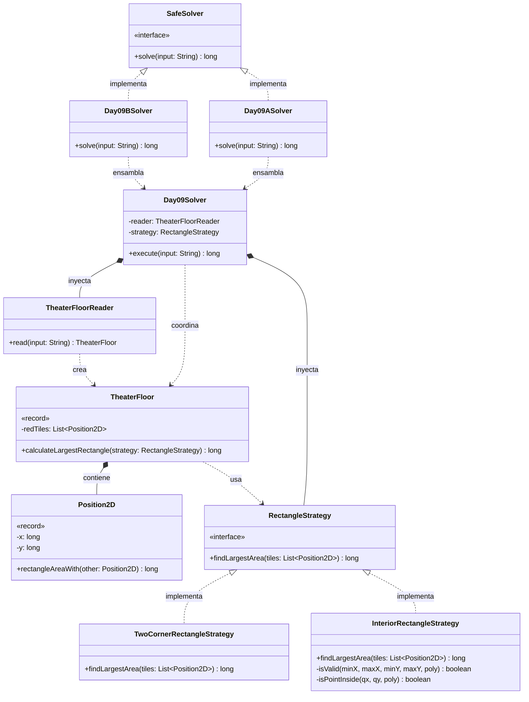

# Día 9: Movie Theater

## Descripción del Problema

Tras llegar a la base del Polo Norte, nos encontramos en la sala de cine. Los elfos están redecorando el suelo de baldosas y nos piden ayuda con un patrón geométrico basado en baldosas rojas.

*   **Parte A**: Se nos proporciona una lista de coordenadas (X, Y) correspondientes a las baldosas rojas en el suelo del cine. El objetivo es encontrar el **rectángulo de mayor área posible** que se pueda formar utilizando *cualquier* par de baldosas rojas como sus esquinas opuestas. El área de este rectángulo se calcula incluyendo las propias baldosas de los bordes.
*   **Parte B**: *(Pendiente de ser revelada)*.

---

## Explicación de las Relaciones y Elementos

*   **Implementación:** `Day09ASolver` implementa la interfaz global `SafeSolver`.
*   **Ensamblaje e Inyección:** Sospechando que la Parte B cambiará las reglas de validación geométrica (ej. exigir 4 esquinas rojas en lugar de 2, o buscar áreas vacías), se ha introducido la interfaz `RectangleStrategy`. El ensamblador inyecta `TwoCornerRectangleStrategy` y `TheaterFloorReader` en el motor principal `Day09Solver`.
*   **Composición y Uso:** El motor `Day09Solver` lee el dominio mediante el reader y le dice al `TheaterFloor`: *"calcula el área máxima usando esta estrategia geométrica"*.

---

## Arquitectura de Clases y Responsabilidades

- **Los Ensambladores y el Motor Principal:**
    *   `SafeSolver` **(Interfaz):** Contrato global.
    *   `Day09ASolver` **(Clase):** Ensamblador de la Parte A.
    *   `Day09Solver` **(Clase):** Orquestador agnóstico.
- **Dominio Geométrico (Patrón Strategy):**
    *   `RectangleStrategy` **(Interfaz):** Define el contrato `findLargestArea(tiles)` para aislar la lógica de combinación y validación de baldosas.
    *   `TwoCornerRectangleStrategy` **(Clase):** Implementa la Parte A. Itera sobre todas las combinaciones posibles de pares de baldosas (fuerza bruta $O(N^2)$) buscando el área máxima, asumiendo que cualquier par forma un rectángulo válido.
- **Dominio de Lectura y Modelado (Value Objects):**
    *   `TheaterFloorReader` **(Clase):** Transforma la entrada de texto plano en una colección de baldosas dentro del `TheaterFloor`.
    *   `TheaterFloor` **(Record):** *Value Object* inmutable. Aplica el principio *Tell, Don't Ask* exponiendo `calculateLargestRectangle(strategy)`.
    *   `Position2D` **(Record):** Encapsula `(x, y)` y la lógica espacial (`rectangleAreaWith`), evitando la obsesión por los primitivos y asegurando que las coordenadas utilicen `long` para prevenir desbordamientos de área.

