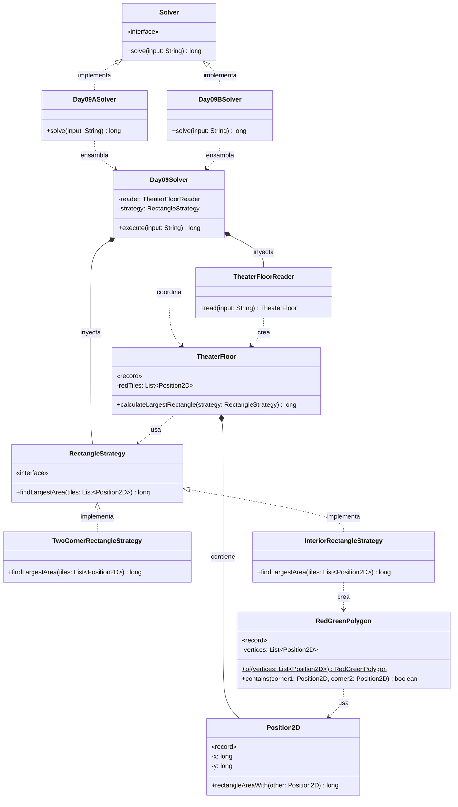

# Día 9: Movie Theater

## Descripción del Problema

Tras bajar por el tobogán del patio de juegos, llegamos al cine de la base del Polo Norte, decorado con un suelo de baldosas. Algunas baldosas son rojas, y su posición viene dada como coordenadas (X, Y) en el input.

*   **Parte A**: Elegir dos baldosas rojas cualesquiera como esquinas opuestas de un rectángulo y encontrar el **área máxima posible**, sin restricción alguna sobre qué hay dentro del rectángulo.
*   **Parte B**: Las baldosas rojas, tomadas en el orden del input, están conectadas entre sí por tramos rectos de baldosas verdes (la lista es cíclica: la última se conecta con la primera), formando un polígono cerrado. Todas las baldosas dentro de ese polígono también son verdes. El rectángulo sigue necesitando dos baldosas rojas como esquinas opuestas, pero ahora **todo su interior debe estar compuesto únicamente por baldosas rojas o verdes** — es decir, debe caber completamente dentro del polígono.

---

## Explicación de las Relaciones y Elementos

*   **Implementación:** `Day09ASolver` y `Day09BSolver` implementan `Solver`, exponiendo únicamente el método público `solve` hacia el exterior.
*   **Ensamblaje e Inyección:** Cada solver específico inyecta la misma dependencia de lectura (`TheaterFloorReader`) junto con la `RectangleStrategy` correspondiente a su parte: `TwoCornerRectangleStrategy` para la Parte A (sin restricción geométrica), `InteriorRectangleStrategy` para la Parte B (con la restricción del polígono rojo-verde).
*   **Composición y Uso (Tell, Don't Ask):** `Day09Solver` delega en `TheaterFloorReader` la creación del `TheaterFloor`, y no extrae la lista de baldosas para procesarla él mismo — le pide al propio `TheaterFloor` que se resuelva: `calculateLargestRectangle(strategy)`. A su vez, `Position2D.rectangleAreaWith(other)` calcula el área de un rectángulo entre dos posiciones sin que ninguna estrategia manipule coordenadas sueltas.
*   **Nota de diseño (SRP):** la lógica de "¿este rectángulo cabe dentro del polígono rojo-verde?" es un problema geométrico independiente de "¿qué par de baldosas produce el área máxima?". Por eso se extrae a un value object dedicado, `RedGreenPolygon`, en vez de dejarla como métodos privados dentro de `InteriorRectangleStrategy`. Esto mantiene la estrategia centrada en su única responsabilidad (iterar candidatos y quedarse con el máximo válido) y hace que la lógica de contención geométrica sea reutilizable y testeable de forma aislada.
*   **Nota de diseño (YAGNI):** al igual que en los días 7 y 8, `TheaterFloorReader` se mantiene como clase concreta sin interfaz — no hay indicio en el enunciado de un segundo formato de lectura que justifique abstraerla.

---

## Arquitectura de Clases y Responsabilidades

- **Los Ensambladores y el Motor Principal:**
  *   `Solver` **(Interfaz):** Contrato global del repositorio para la ejecución de cualquier día.
  *   `Day09ASolver` **(Clase):** Implementa `Solver`. Inyecta `TwoCornerRectangleStrategy` en el motor central.
  *   `Day09BSolver` **(Clase):** Implementa `Solver`. Inyecta `InteriorRectangleStrategy` en el mismo motor, reutilizando por completo la lectura y el modelo de dominio.
  *   `Day09Solver` **(Clase):** Orquestador agnóstico. Lee el input a través de `TheaterFloorReader` y delega en el `TheaterFloor` resultante la ejecución de la estrategia inyectada.
- **Dominio de Lectura y Modelado (Value Objects):**
  *   `TheaterFloorReader` **(Clase):** Parsea el input en un `TheaterFloor`, preservando el orden de aparición de las baldosas rojas — orden que resulta imprescindible para la Parte B, ya que define los vértices del polígono.
  *   `TheaterFloor` **(Record):** *Value Object* inmutable que contiene la lista de baldosas rojas. Expone `calculateLargestRectangle(strategy)`, delegando en la estrategia inyectada el criterio concreto de validez del rectángulo.
  *   `Position2D` **(Record):** Representa una coordenada `(x, y)` y expone `rectangleAreaWith(other)`, encapsulando el cálculo de área entre dos esquinas.
  *   `RedGreenPolygon` **(Record):** *Value Object* que representa el polígono cerrado formado por las baldosas rojas en orden de recorrido. Expone `contains(corner1, corner2)`, respondiendo si el rectángulo definido por esas dos esquinas cabe íntegramente dentro del polígono (rojo o verde), ocultando toda la lógica de point-in-polygon y límites geométricos tras un único método público.
- **Dominio de Estrategia (Polimorfismo):**
  *   `RectangleStrategy` **(Interfaz):** Contrato `findLargestArea(tiles)` que permite inyectar el criterio completo de búsqueda del rectángulo máximo, sin acoplar `TheaterFloor` a los detalles de cada parte.
  *   `TwoCornerRectangleStrategy` **(Clase):** Implementación para la Parte A. Itera todas las combinaciones de pares de baldosas rojas y se queda con el área máxima, sin ninguna restricción adicional.
  *   `InteriorRectangleStrategy` **(Clase):** Implementación para la Parte B. Construye un `RedGreenPolygon` a partir de las baldosas recibidas y, para cada par candidato, solo lo considera válido si `polygon.contains(corner1, corner2)` es cierto, quedándose con el área máxima entre los válidos.

---

## Fundamentos y Principios de Diseño Aplicados

*   **Principio de Responsabilidad Única (SRP):** `Position2D` calcula áreas entre esquinas; `RedGreenPolygon` decide contención geométrica; cada `RectangleStrategy` decide qué pares considerar y con qué criterio de validez; `Day09Solver` solo orquesta.
*   **Strategy Pattern:** la diferencia entre la Parte A (sin restricción) y la Parte B (con restricción de polígono) se resuelve inyectando una `RectangleStrategy` distinta, sin introducir condicionales en `TheaterFloor` ni en `Day09Solver`.
*   **Tell, Don't Ask:** `TheaterFloor` no expone su lista de baldosas para que la estrategia calcule áreas por fuera; `RedGreenPolygon` no expone sus vértices para que la estrategia haga point-in-polygon manualmente — ambos se preguntan directamente (`calculateLargestRectangle`, `contains`).
*   **Extracción de un Value Object para aislar complejidad geométrica:** en vez de dejar la lógica de point-in-polygon como métodos privados de `InteriorRectangleStrategy`, se modela como `RedGreenPolygon`, reduciendo el acoplamiento de la estrategia a los detalles de la geometría y haciendo esa lógica reutilizable y testeable de forma independiente.
*   **YAGNI:** `TheaterFloorReader` se mantiene sin interfaz, coherente con la decisión tomada en los días 7 y 8 — no existe una segunda fuente de datos que lo justifique.
*   **Inmutabilidad:** `TheaterFloor`, `Position2D` y `RedGreenPolygon` son records inmutables; ninguna operación de cálculo altera el estado del dominio.
*   **Inyección de Dependencias y OCP:** `Day09Solver` no crea `TheaterFloorReader` ni `RectangleStrategy` — ambos se inyectan desde los solvers concretos. Una hipotética tercera variante de restricción geométrica solo requeriría una nueva implementación de `RectangleStrategy`, sin tocar `Day09Solver` ni `TheaterFloor`.
*   **Principio de Sustitución de Liskov (LSP):** cualquier `RectangleStrategy` concreta puede sustituir a su contrato sin alterar el comportamiento esperado del resto del sistema.

---

## Mecanismos del Lenguaje

*   **Records con factory estático:** `RedGreenPolygon.of(vertices)` sigue el mismo patrón que `Rotation.fromString()` (día 1) y `Operator.fromSymbol()` (día 6) — un punto de construcción explícito y con nombre, en vez de exponer el constructor canónico del record directamente en el código cliente.
*   **Polimorfismo (Upcasting):** `Day09Solver` y `TheaterFloor` trabajan con `RectangleStrategy` de forma genérica, sin conocer si la instancia concreta es `TwoCornerRectangleStrategy` o `InteriorRectangleStrategy`.
*   **API de Streams:** útil tanto para generar las combinaciones de pares de baldosas rojas como para filtrar los candidatos válidos según `RedGreenPolygon.contains()` antes de quedarse con el máximo.