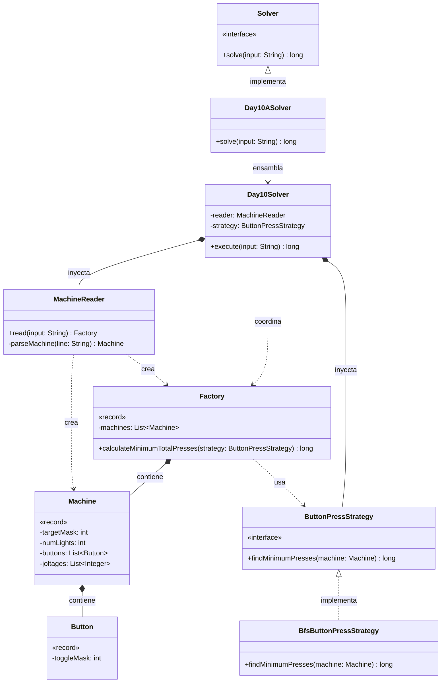

# Día 10: Factory

## Descripción del Problema

Tras cruzar el pasillo del cine, entramos en una enorme fábrica donde las máquinas están apagadas. El manual de inicialización está parcialmente destruido, conservando solo los esquemas de las luces indicadoras, el cableado de los botones y los requisitos de voltaje.

*   **Parte A**: Cada máquina tiene un estado objetivo para sus luces indicadoras (representado por `.` para apagado y `#` para encendido). Inicialmente, todas las luces están apagadas. Contamos con una serie de botones que alternan (encienden/apagan) luces específicas. Se debe calcular el **número mínimo de pulsaciones de botones** necesarias para alcanzar el estado objetivo de cada máquina, e ignorar los requisitos de voltaje. El resultado final es la suma de las pulsaciones mínimas de todas las máquinas.
*   **Parte B**: *(Pendiente de ser revelada)*.

---

## Explicación de las Relaciones y Elementos

*   **Implementación:** `Day10ASolver` implementa la interfaz global `Solver`.
*   **Ensamblaje e Inyección:** Sospechando que la Parte B podría introducir lógicas distintas de cálculo (como priorizar el voltaje, o algoritmos más complejos si el número de botones crece masivamente), el ensamblador inyecta `BfsButtonPressStrategy` y `MachineReader` en el motor principal `Day10Solver`.
*   **Composición y Uso:** El motor lee el input y delega en el objeto de dominio raíz, `Factory`, la tarea de calcular el total de pulsaciones, inyectándole la estrategia de cálculo para que mantenga el control (Tell, Don't Ask).

---

## Arquitectura de Clases y Responsabilidades

- **Los Ensambladores y el Motor Principal:**
    *   `Solver` **(Interfaz):** Contrato global del repositorio.
    *   `Day10ASolver` **(Clase):** Ensamblador de la Parte A.
    *   `Day10Solver` **(Clase):** Orquestador agnóstico.
- **Dominio de Simulación (Patrón Strategy):**
    *   `ButtonPressStrategy` **(Interfaz):** Define el contrato `findMinimumPresses(machine)` aislando el algoritmo de búsqueda.
    *   `BfsButtonPressStrategy` **(Clase):** Implementa la Parte A. Utiliza un algoritmo de *Breadth-First Search* (Búsqueda en Anchura) sobre el espacio de estados. Al explorar los estados por niveles, el primer camino que encuentra el estado objetivo está matemáticamente garantizado como el más corto.
- **Dominio de Lectura y Modelado (Value Objects):**
    *   `MachineReader` **(Clase):** Parsea las complejas cadenas de texto utilizando expresiones regulares para extraer el objetivo, los botones y los voltajes.
    *   `Factory` **(Record):** *Value Object* que actúa como Aggregate Root. Contiene la lista de máquinas y expone `calculateMinimumTotalPresses(strategy)`.
    *   `Machine` **(Record):** Representa una máquina concreta. Evita manejar arrays de booleanos transformando el estado de las luces a un `targetMask` (Bitmask), optimizando enormemente la simulación.
    *   `Button` **(Record):** Encapsula el comportamiento de un botón como una máscara de bits (`toggleMask`).

