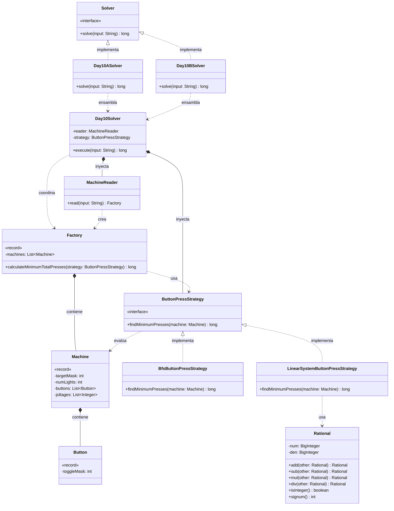

# Día 10: Factory

## Descripción del Problema

Cruzando el pasillo llegamos a una fábrica con las máquinas apagadas. El manual de inicialización está incompleto, pero conservamos los diagramas de luces indicadoras, el cableado de los botones y los requisitos de joltaje de cada máquina. El input describe una máquina por línea: un diagrama de luces entre corchetes, uno o más botones entre paréntesis (cada uno indicando qué índices afecta), y unos requisitos de joltaje entre llaves.

*   **Parte A**: Cada máquina empieza con todas sus luces apagadas. Pulsar un botón alterna (toggle) el estado de las luces que indica. Hay que encontrar, para cada máquina, el **mínimo número de pulsaciones** necesario para que el patrón de luces coincida exactamente con el diagrama objetivo, y sumar ese mínimo entre todas las máquinas.
*   **Parte B**: Los requisitos de joltaje pasan a ser relevantes y las luces se ignoran. Cada máquina tiene un contador por requisito de joltaje, todos inicialmente en 0. Pulsar un botón ahora **incrementa en 1** cada contador que indica (en vez de alternar un estado binario). Hay que encontrar, para cada máquina, el mínimo número de pulsaciones necesario para que todos los contadores alcancen exactamente sus valores objetivo, y sumar ese mínimo entre todas las máquinas.

---

## Explicación de las Relaciones y Elementos

*   **Implementación:** `Day10ASolver` y `Day10BSolver` implementan `Solver`, exponiendo únicamente el método público `solve` hacia el exterior.
*   **Ensamblaje e Inyección:** Cada solver específico inyecta la misma dependencia de lectura (`MachineReader`) junto con la `ButtonPressStrategy` correspondiente a su parte: `BfsButtonPressStrategy` para la Parte A (alternar luces), `LinearSystemButtonPressStrategy` para la Parte B (incrementar contadores).
*   **Composición y Uso (Tell, Don't Ask):** `Day10Solver` delega en `MachineReader` la creación del `Factory` completo, y no itera él mismo sobre las máquinas — le pide al propio `Factory` que se resuelva: `calculateMinimumTotalPresses(strategy)`. Internamente, `Factory` recorre su colección de `Machine` aplicando la estrategia inyectada a cada una y sumando los resultados.
*   **Nota de diseño (modelo de datos compartido):** `Machine` conserva en un único record tanto los datos relevantes para la Parte A (`targetMask`, `numLights`) como para la Parte B (`joltages`), ya que ambas partes parsean exactamente la misma línea de input. Separar esto en dos modelos distintos obligaría a `MachineReader` a parsear el mismo texto dos veces sin ninguna ganancia real de cohesión.
*   **Nota de diseño (reutilización de representación):** `Button.toggleMask` se interpreta con semántica distinta según la estrategia activa — como máscara de bits a los que aplicar XOR en la Parte A, o como conjunto de índices de contadores a incrementar en la Parte B — evitando duplicar el modelo de "qué índices afecta este botón" en dos clases distintas.
*   **Nota de diseño (planteamiento algebraico en vez de búsqueda por fuerza bruta):** un primer enfoque de la Parte B mediante backtracking puro con poda (probando todas las combinaciones de pulsaciones por botón) resultaba en saturación de memoria para inputs reales, debido a la explosión combinatoria del espacio de búsqueda. Se reformuló el problema como un **sistema de ecuaciones lineales** `A·x = target`, donde cada columna de `A` es el vector de contadores que afecta un botón. Cuando el sistema es determinado (rango de `A` igual al número de botones), la solución es única y se obtiene con eliminación gaussiana en tiempo polinómico, sin ninguna búsqueda. Solo si sobran variables libres se recurre a una búsqueda acotada, y exclusivamente sobre esas variables — nunca sobre el sistema completo.
*   **Nota de diseño (aritmética exacta):** la eliminación gaussiana se realiza con fracciones exactas (`Rational`, basada en `BigInteger`) en vez de `double`, para evitar errores de precisión de punto flotante que invalidarían la comprobación de "solución entera y no negativa" exigida por el dominio del problema.
*   **Nota de diseño (YAGNI):** al igual que en los días 7, 8 y 9, `MachineReader` se mantiene como clase concreta sin interfaz, al no existir ningún indicio de un segundo formato de entrada.

---

## Arquitectura de Clases y Responsabilidades

- **Los Ensambladores y el Motor Principal:**
  *   `Solver` **(Interfaz):** Contrato global del repositorio para la ejecución de cualquier día.
  *   `Day10ASolver` **(Clase):** Implementa `Solver`. Inyecta `BfsButtonPressStrategy` en el motor central.
  *   `Day10BSolver` **(Clase):** Implementa `Solver`. Inyecta `LinearSystemButtonPressStrategy` en el mismo motor, reutilizando por completo la lectura y el modelo de dominio.
  *   `Day10Solver` **(Clase):** Orquestador agnóstico. Lee el input a través de `MachineReader` y delega en el `Factory` resultante la ejecución de la estrategia inyectada.
- **Dominio de Lectura y Modelado (Value Objects):**
  *   `MachineReader` **(Clase):** Parsea cada línea del input en un `Machine`, extrayendo el diagrama de luces, la lista de botones y los requisitos de joltaje, y agrupa el resultado en un `Factory`.
  *   `Factory` **(Record):** *Value Object* inmutable que contiene la colección de `Machine`. Expone `calculateMinimumTotalPresses(strategy)`, delegando en la estrategia el cálculo por máquina y sumando el resultado total.
  *   `Machine` **(Record):** Representa una máquina individual con su objetivo de luces (`targetMask`, `numLights`), sus botones (`buttons`) y sus requisitos de joltaje (`joltages`) — el conjunto completo de datos parseados de una línea del input.
  *   `Button` **(Record):** Representa un botón mediante `toggleMask`, la máscara de bits de los índices (luces o contadores, según el contexto) que afecta al pulsarlo.
- **Dominio de Estrategia (Polimorfismo):**
  *   `ButtonPressStrategy` **(Interfaz):** Contrato `findMinimumPresses(machine)` que permite inyectar el algoritmo de búsqueda del mínimo de pulsaciones sin acoplar `Factory` a los detalles de cada parte.
  *   `BfsButtonPressStrategy` **(Clase):** Implementación para la Parte A. Explora el espacio de estados de luces (encendido/apagado) mediante búsqueda en anchura, interpretando `Button.toggleMask` como una operación XOR sobre el estado actual, hasta alcanzar `targetMask`.
  *   `LinearSystemButtonPressStrategy` **(Clase):** Implementación para la Parte B. Modela el sistema `A·x = target` y lo resuelve por eliminación gaussiana con aritmética racional exacta. Si el sistema queda determinado, devuelve la solución única sin búsqueda; si quedan variables libres, acota cada una según el requisito mínimo entre los contadores que su botón afecta (una cota derivada de la matriz original, no de la reducida, para evitar coeficientes negativos introducidos por la propia eliminación) y realiza una búsqueda en profundidad solo sobre esas variables, con poda por cota parcial.
- **Dominio Auxiliar (Aritmética Exacta):**
  *   `Rational` **(Clase):** Representa una fracción reducida basada en `BigInteger`, con las operaciones necesarias para la eliminación gaussiana (`add`, `sub`, `mul`, `div`) y comprobaciones de dominio (`isInteger`, `signum`), evitando por completo el uso de `double` en el cálculo.

---

## Fundamentos y Principios de Diseño Aplicados

*   **Principio de Responsabilidad Única (SRP):** `MachineReader` solo parsea; `Factory` agrega y totaliza; cada `ButtonPressStrategy` encapsula un algoritmo de búsqueda completo y distinto; `Rational` encapsula exclusivamente la aritmética exacta; `Day10Solver` solo orquesta.
*   **Strategy Pattern:** la diferencia entre alternar luces (Parte A) e incrementar contadores (Parte B) se resuelve inyectando una `ButtonPressStrategy` distinta, sin introducir condicionales de "modo" en `Machine`, `Factory` ni `Day10Solver`.
*   **Tell, Don't Ask:** `Factory` no expone su lista de `Machine` para que el orquestador itere por fuera; se pregunta a sí mismo el total (`calculateMinimumTotalPresses(strategy)`), delegando en la estrategia el cálculo por máquina individual.
*   **Elegir el modelo algorítmico correcto en vez de fuerza bruta con poda:** el primer enfoque (backtracking exhaustivo sobre todas las combinaciones de pulsaciones) no escalaba porque atacaba el problema como una búsqueda combinatoria cuando en realidad es, en su caso general, un sistema de ecuaciones lineales. Reconocer esa estructura reduce la complejidad de exponencial a polinómica en el caso determinado, que es el dominante en este ejercicio.
*   **Corrección antes que optimización:** la primera versión de la búsqueda de respaldo (para sistemas subdeterminados) calculaba cotas superiores sobre la matriz ya reducida por Gauss, lo cual podía descartar soluciones válidas por culpa de coeficientes negativos introducidos por la propia eliminación. La cota correcta se deriva de la matriz **original** (`Button.toggleMask`), aprovechando que cada pulsación solo puede sumar, nunca restar, a los contadores — una propiedad física del dominio, no un artefacto algebraico.
*   **Precisión numérica como requisito de corrección, no solo de estilo:** usar `Rational`/`BigInteger` en vez de `double` no es una preferencia estilística — un resultado no exactamente entero por error de redondeo invalidaría silenciosamente la comprobación `isInteger()`, produciendo respuestas incorrectas en vez de una excepción clara.
*   **Reutilización de representación sobre duplicación de modelo:** `Button.toggleMask` se reinterpreta semánticamente entre estrategias en vez de crear un `LightButton` y un `JoltageButton` separados.
*   **YAGNI:** `MachineReader` se mantiene sin interfaz, coherente con la decisión de los días 7 a 9 — no existe una segunda fuente de datos que lo justifique.
*   **Inmutabilidad:** `Factory`, `Machine`, `Button` y `Rational` son inmutables; ninguna operación de búsqueda o cálculo muta el estado de una máquina ni de una fracción ya creada.
*   **Inyección de Dependencias y OCP:** `Day10Solver` no crea `MachineReader` ni `ButtonPressStrategy` — ambos se inyectan desde los solvers concretos. Un hipotético tercer modo de operación de las máquinas solo requeriría una nueva implementación de `ButtonPressStrategy`, sin tocar `Day10Solver`, `Factory` ni `Machine`.
*   **Principio de Sustitución de Liskov (LSP):** cualquier `ButtonPressStrategy` concreta puede sustituir a su contrato sin alterar el comportamiento esperado del resto del sistema, pese a resolver problemas algorítmicamente distintos (búsqueda de estados binarios vs. resolución algebraica de sistemas lineales).

---

## Mecanismos del Lenguaje

*   **Bitmasks (`int` como conjunto de índices):** `targetMask` y `toggleMask` codifican de forma compacta y eficiente qué luces o contadores están implicados, permitiendo operaciones XOR/OR a nivel de bits en vez de manipular colecciones booleanas.
*   **`BigInteger` para aritmética exacta:** `Rational` se apoya en `BigInteger` en vez de tipos primitivos, evitando tanto errores de precisión como desbordamientos durante la eliminación gaussiana.
*   **Polimorfismo (Upcasting):** `Day10Solver` y `Factory` trabajan con `ButtonPressStrategy` de forma genérica, sin conocer si la instancia concreta es `BfsButtonPressStrategy` o `LinearSystemButtonPressStrategy`.
*   **API de Streams:** útil tanto para sumar los resultados individuales de cada `Machine` en `Factory.calculateMinimumTotalPresses` como para el procesamiento declarativo del parseo de botones y joltajes en `MachineReader`.