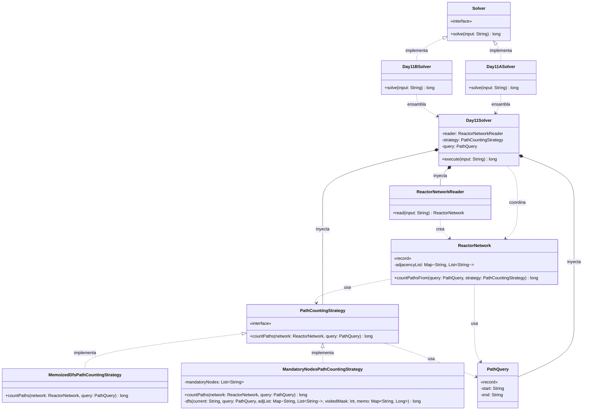

# Día 11: Reactor

## Descripción del Problema

Tras bajar por una escalera desde la fábrica, llegamos a un reactor toroidal conectado a una nueva rack de servidores mediante una maraña de cables. El input es una lista de dispositivos, cada uno con sus conexiones de salida (los datos solo fluyen hacia adelante, nunca hacia atrás).

*   **Parte A**: Encontrar **todos los caminos posibles** desde el dispositivo `you` hasta el dispositivo `out`, siguiendo únicamente las conexiones de salida.
*   **Parte B**: Encontrar todos los caminos desde `svr` hasta `out`, pero contando solo aquellos que pasan **tanto por `dac` como por `fft`** (en cualquier orden).

---

## Explicación de las Relaciones y Elementos

*   **Implementación:** `Day11ASolver` y `Day11BSolver` implementan `Solver`, exponiendo únicamente el método público `solve` hacia el exterior.
*   **Ensamblaje e Inyección:** Cada solver específico inyecta la misma dependencia de lectura (`ReactorNetworkReader`) junto con la `PathCountingStrategy` y la `PathQuery` correspondientes a su parte: `MemoizedDfsPathCountingStrategy` con `PathQuery("you", "out")` para la Parte A, `MandatoryNodesPathCountingStrategy` (configurada con los nodos obligatorios `dac` y `fft`) con `PathQuery("svr", "out")` para la Parte B.
*   **Composición y Uso (Tell, Don't Ask + doble despacho):** `Day11Solver` delega en `ReactorNetworkReader` la creación del `ReactorNetwork`, y no recorre él mismo la lista de adyacencia — le pide al propio `ReactorNetwork` que se resuelva: `countPathsFrom(query, strategy)`. Internamente, `ReactorNetwork` delega el recorrido en la estrategia inyectada, pasándose a sí mismo como parámetro — necesario porque, a diferencia de otros días, un algoritmo de recorrido de grafo requiere genuinamente la estructura completa del dominio (`adjacencyList`), no solo una porción extraíble de datos.
*   **Nota de diseño (evitar primitive obsession):** en vez de que `Day11Solver` mantenga `startNode` y `endNode` como dos `String` sueltos, ambos se agrupan en un único value object, `PathQuery`. Esto evita el riesgo de invertir accidentalmente origen y destino al ensamblar un solver, y sigue la misma convención aplicada en días anteriores para evitar pares de primitivos sin significado propio (`Position`, `IngredientsRange`).
*   **Nota de diseño (bitmask para nodos obligatorios):** siguiendo el mismo patrón que `Button.toggleMask` en el día 10, `MandatoryNodesPathCountingStrategy` representa qué nodos obligatorios se han visitado en el recorrido actual mediante un `int` como máscara de bits (`visitedMask`), en vez de un `boolean` por cada nodo obligatorio. Esto generaliza la solución a cualquier número de nodos obligatorios sin añadir parámetros nuevos, y permite memoizar el DFS con una clave compuesta simple (`nodo actual + máscara`).
*   **Nota de diseño (YAGNI):** al igual que en los días 7 a 10, `ReactorNetworkReader` se mantiene como clase concreta sin interfaz, al no existir ningún indicio de un segundo formato de entrada.

---

## Arquitectura de Clases y Responsabilidades

- **Los Ensambladores y el Motor Principal:**
  *   `Solver` **(Interfaz):** Contrato global del repositorio para la ejecución de cualquier día.
  *   `Day11ASolver` **(Clase):** Implementa `Solver`. Inyecta `MemoizedDfsPathCountingStrategy` y `PathQuery("you", "out")` en el motor central.
  *   `Day11BSolver` **(Clase):** Implementa `Solver`. Inyecta `MandatoryNodesPathCountingStrategy` (con `dac`/`fft` como nodos obligatorios) y `PathQuery("svr", "out")` en el mismo motor, reutilizando por completo la lectura y el modelo de dominio.
  *   `Day11Solver` **(Clase):** Orquestador agnóstico. Lee el input a través de `ReactorNetworkReader` y delega en el `ReactorNetwork` resultante la ejecución de la estrategia con la consulta inyectada.
- **Dominio de Lectura y Modelado (Value Objects):**
  *   `ReactorNetworkReader` **(Clase):** Parsea cada línea del input (`dispositivo: salida1 salida2 ...`) en una lista de adyacencia, agrupándola en un `ReactorNetwork`.
  *   `ReactorNetwork` **(Record):** *Value Object* inmutable que contiene la lista de adyacencia completa del grafo. Expone `countPathsFrom(query, strategy)`, delegando en la estrategia inyectada el criterio de conteo sin exponer su estructura interna al orquestador.
  *   `PathQuery` **(Record):** *Value Object* que agrupa el nodo de origen y el de destino de una búsqueda, evitando manejar `start`/`end` como parámetros primitivos sueltos en cascada por todas las firmas del dominio.
- **Dominio de Estrategia (Polimorfismo):**
  *   `PathCountingStrategy` **(Interfaz):** Contrato `countPaths(network, query)` que permite inyectar el algoritmo completo de conteo de caminos sin acoplar `ReactorNetwork` a los detalles de cada parte.
  *   `MemoizedDfsPathCountingStrategy` **(Clase):** Implementación para la Parte A. Recorre el grafo en profundidad desde `query.start()` hasta `query.end()`, memoizando el número de caminos restantes desde cada nodo ya visitado para evitar recomputación en grafos con nodos compartidos por múltiples caminos.
  *   `MandatoryNodesPathCountingStrategy` **(Clase):** Implementación para la Parte B. Realiza el mismo recorrido en profundidad, pero además rastrea, mediante una máscara de bits (`visitedMask`), cuáles de los nodos obligatorios configurados (`mandatoryNodes`) se han visitado en el camino actual, contando solo los caminos que alcanzan `query.end()` con todos los nodos obligatorios marcados.

---

## Fundamentos y Principios de Diseño Aplicados

*   **Principio de Responsabilidad Única (SRP):** `ReactorNetworkReader` solo parsea; `ReactorNetwork` representa el grafo y coordina el conteo; cada `PathCountingStrategy` encapsula un algoritmo de recorrido distinto; `Day11Solver` solo orquesta.
*   **Strategy Pattern con doble despacho:** la diferencia entre contar todos los caminos (Parte A) y contar solo los que pasan por nodos obligatorios (Parte B) se resuelve inyectando una `PathCountingStrategy` distinta. `ReactorNetwork` se pasa a sí mismo a la estrategia porque un recorrido de grafo requiere la estructura completa, no una porción extraíble — igual que `AccessRule.canAccess(paperGrid, position)` en el día 4.
*   **Evitar primitive obsession:** `PathQuery` agrupa `start`/`end` en un único value object, en vez de dos `String` sueltos viajando por separado en cascada por `Day11Solver`, `ReactorNetwork` y `PathCountingStrategy` — mismo criterio aplicado a `Position` (día 4), `IngredientsRange` (día 5) y `Rational` (día 10).
*   **Bitmasks para conjuntos de estado pequeños:** `visitedMask` en `MandatoryNodesPathCountingStrategy` sigue el mismo patrón que `Button.toggleMask` (día 10) para representar de forma compacta qué nodos obligatorios se han visitado, en vez de un `boolean` por nodo.
*   **Tell, Don't Ask:** `ReactorNetwork` no expone su lista de adyacencia para que el orquestador la recorra por fuera; se pregunta a sí mismo el conteo (`countPathsFrom(query, strategy)`).
*   **YAGNI:** `ReactorNetworkReader` se mantiene sin interfaz, coherente con la decisión de los días 7 a 10 — no existe una segunda fuente de datos que lo justifique.
*   **Inmutabilidad:** `ReactorNetwork` y `PathQuery` son records inmutables; ninguna operación de conteo altera la estructura del grafo original.
*   **Inyección de Dependencias y OCP:** `Day11Solver` no crea `ReactorNetworkReader`, `PathCountingStrategy` ni `PathQuery` — los tres se inyectan desde los solvers concretos. Un hipotético tercer criterio de conteo (por ejemplo, caminos que *eviten* ciertos nodos) solo requeriría una nueva implementación de `PathCountingStrategy`, sin tocar `Day11Solver` ni `ReactorNetwork`.
*   **Principio de Sustitución de Liskov (LSP):** cualquier `PathCountingStrategy` concreta puede sustituir a su contrato sin alterar el comportamiento esperado del resto del sistema.

---

## Mecanismos del Lenguaje

*   **Grafos representados como `Map<String, List<String>>`:** modela de forma directa la lista de adyacencia leída del input, sin necesidad de una estructura de grafo más compleja para este problema.
*   **Memoización sobre recursión (DFS + `Map` de caché):** ambas estrategias evitan recomputar el número de caminos desde nodos ya visitados, clave para que el recorrido escale en grafos con muchos caminos que convergen en nodos compartidos.
*   **Bitmasks (`int` como conjunto de índices):** reutilización del mismo mecanismo del día 10 para representar de forma compacta qué nodos obligatorios se han visitado en el camino actual.
*   **Polimorfismo (Upcasting):** `Day11Solver` y `ReactorNetwork` trabajan con `PathCountingStrategy` de forma genérica, sin conocer si la instancia concreta es `MemoizedDfsPathCountingStrategy` o `MandatoryNodesPathCountingStrategy`.