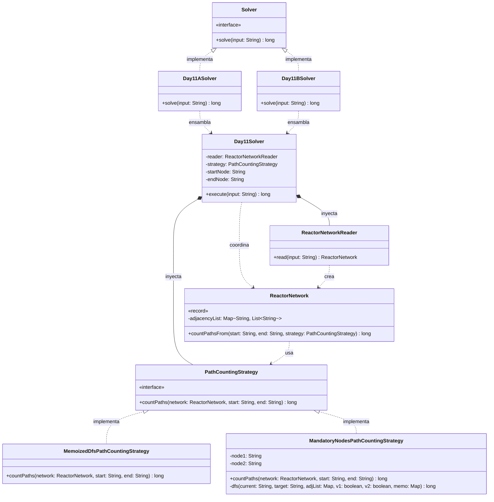

# Día 11: Reactor

## Descripción del Problema

Tras bajar por una escotilla, encontramos el reactor toroidal que alimenta la fábrica. Los elfos tienen problemas de comunicación entre el servidor y el reactor debido a un laberinto de cables y dispositivos.

*   **Parte A**: Se proporciona una lista de dispositivos y las salidas hacia las que envían datos. Los datos fluyen en una sola dirección (formando un Grafo Acíclico Dirigido o DAG). El objetivo es calcular el **número total de caminos únicos** que conectan el dispositivo etiquetado como `you` con el dispositivo etiquetado como `out`.
*   **Parte B**: *(Pendiente de ser revelada)*.

---

## Explicación de las Relaciones y Elementos

*   **Implementación:** `Day11ASolver` implementa la interfaz global `Solver`.
*   **Ensamblaje e Inyección:** La tarea matemática de contar caminos en un grafo puede variar drásticamente en la Parte B (podrían introducir ciclos, pesos en las aristas, o restricciones de paso). Por ello, el ensamblador inyecta una `PathCountingStrategy` (`MemoizedDfsPathCountingStrategy`) en el orquestador `Day11Solver`.
*   **Composición y Uso (Tell, Don't Ask):** `ReactorNetwork` es el *Aggregate Root*. En lugar de exponer su lista de adyacencia mediante *getters*, se le ordena calcular los caminos a través del método `countPathsFrom(start, end, strategy)`, cediendo sus datos a la estrategia inyectada.

---

## Arquitectura de Clases y Responsabilidades

- **Los Ensambladores y el Motor Principal:**
    *   `Solver` **(Interfaz):** Contrato global del repositorio.
    *   `Day11ASolver` **(Clase):** Ensamblador de la Parte A. Inyecta la estrategia y el lector de red.
    *   `Day11Solver` **(Clase):** Orquestador agnóstico de las reglas de recorrido de grafos.
- **Dominio de Búsqueda (Patrón Strategy):**
    *   `PathCountingStrategy` **(Interfaz):** Contrato que aísla el algoritmo de cálculo de caminos (`countPaths`).
    *   `MemoizedDfsPathCountingStrategy` **(Clase):** Implementa un algoritmo *Depth-First Search* (DFS). Al tratarse de un problema combinatorio en un DAG, utiliza **Programación Dinámica (Memoización)**. Mantiene una caché interna local para recordar cuántos caminos hay desde un nodo intermedio hasta el final, reduciendo el tiempo de ejecución de exponencial $O(2^N)$ a lineal $O(V + E)$.
- **Dominio de Lectura y Modelado (Value Objects):**
    *   `ReactorNetworkReader` **(Clase):** Parsea las reglas de texto plano (`dispositivo: salida1 salida2`) y construye el diccionario de adyacencia.
    *   `ReactorNetwork` **(Record):** *Value Object* inmutable que encapsula el grafo mediante un `Map<String, List<String>>`.

