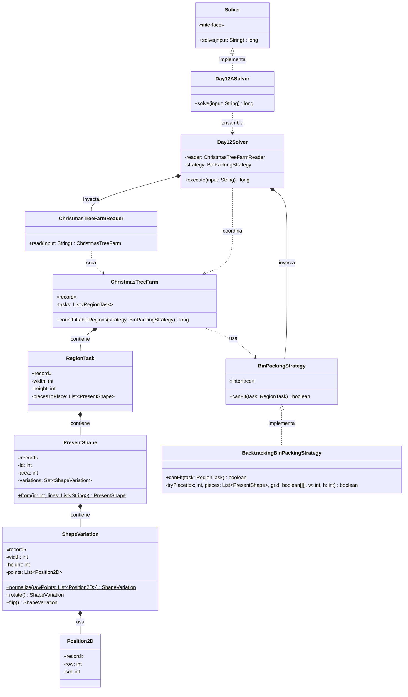

# Día 12: Christmas Tree Farm

## Descripción del Problema

Tras colarnos por un conducto de ventilación, llegamos a una granja de árboles de Navidad. Los Elfos necesitan saber si los regalos con formas irregulares caben bajo cada árbol, respetando una cuadrícula 2D sin solapamientos, pudiendo rotar y voltear cada pieza libremente. El input describe primero el catálogo de formas de regalo (cada una como una cuadrícula de `#`/`.`), y después una lista de regiones, cada una con su ancho, alto y la cantidad de regalos de cada forma que debe contener.

*   **Parte única**: Determinar en cuántas regiones es posible encajar **todos** los regalos solicitados, sin solapamientos, permitiendo rotar y voltear cada pieza según haga falta.

Este día no tiene Parte B — es el cierre del calendario de Advent of Code, y la segunda mitad del enunciado es únicamente la narrativa de cierre de la historia, sin un problema adicional que resolver. Por eso la arquitectura solo incluye `Day12ASolver`, sin `Day12BSolver`.

---

## Explicación de las Relaciones y Elementos

*   **Implementación:** `Day12ASolver` implementa `Solver`, exponiendo únicamente el método público `solve` hacia el exterior.
*   **Ensamblaje e Inyección:** `Day12ASolver` inyecta `ChristmasTreeFarmReader` y `BacktrackingBinPackingStrategy` en el motor genérico `Day12Solver`. Al no existir Parte B, la interfaz `BinPackingStrategy` no tiene, de momento, una segunda implementación real — se mantiene de todos modos porque separa con claridad el algoritmo de empaquetado del resto del orquestador, no como preparación para una variación que no va a llegar.
*   **Composición y Uso (Tell, Don't Ask):** `Day12Solver` delega en `ChristmasTreeFarmReader` la creación del `ChristmasTreeFarm`, y no itera él mismo las regiones — le pide al propio `ChristmasTreeFarm` que se resuelva: `countFittableRegions(strategy)`. `ChristmasTreeFarm` recorre sus `RegionTask` aplicando la estrategia a cada una y contando cuántas encajan.
*   **Nota de diseño (precálculo de variaciones):** cada `PresentShape` precalcula, en el momento de construirse (`from`), el conjunto completo de sus orientaciones posibles (`Set<ShapeVariation>`), aplicando rotaciones y reflejos hasta agotar las combinaciones. Usar `Set` en vez de `List` deduplica automáticamente las variaciones que resultan idénticas por simetría de la forma (evitando probar la misma orientación dos veces durante el backtracking). Este precálculo se hace una única vez por forma, no en cada intento de colocación, evitando recomputación redundante dentro del algoritmo de bin packing.
*   **Nota de diseño (normalización como invariante de construcción):** `ShapeVariation.normalize()` traslada los puntos de la forma para que su esquina superior-izquierda quede siempre en `(0,0)`, garantizando que dos variaciones equivalentes por rotación/reflejo sean comparables por `equals()` de forma consistente — imprescindible para que la deduplicación en el `Set` funcione correctamente.
*   **Nota de diseño (mutabilidad acotada por rendimiento):** a diferencia del resto del dominio del proyecto, que se modela con records inmutables, `BacktrackingBinPackingStrategy` opera sobre un array mutable `boolean[][]` que se marca y desmarca directamente durante la recursión. Es una excepción deliberada: clonar la cuadrícula en cada rama del backtracking sería prohibitivamente costoso dado el volumen de combinaciones a explorar. La mutabilidad queda completamente encapsulada dentro del algoritmo — ninguna otra clase del dominio conoce ni depende de ese array. Mismo criterio que se aplicó con `UnionFind` (uso de `int[]` primitivos) en el día 8.

---

## Arquitectura de Clases y Responsabilidades

- **El Ensamblador y el Motor Principal:**
  *   `Solver` **(Interfaz):** Contrato global del repositorio para la ejecución de cualquier día.
  *   `Day12ASolver` **(Clase):** Implementa `Solver`. Inyecta `BacktrackingBinPackingStrategy` y `ChristmasTreeFarmReader` en el motor central.
  *   `Day12Solver` **(Clase):** Orquestador agnóstico. Lee el input a través de `ChristmasTreeFarmReader` y delega en el `ChristmasTreeFarm` resultante el conteo de regiones que caben.
- **Dominio de Lectura y Modelado (Value Objects):**
  *   `ChristmasTreeFarmReader` **(Clase):** Parsea el input en dos bloques — el catálogo de formas y la lista de regiones — construyendo un `ChristmasTreeFarm` completo. Se mantiene sin interfaz (YAGNI), coherente con la decisión de los días 7 a 11.
  *   `ChristmasTreeFarm` **(Record):** *Value Object* inmutable que contiene la lista de `RegionTask` a evaluar. Expone `countFittableRegions(strategy)`, delegando en la estrategia el criterio de encaje por región y contando cuántas lo satisfacen.
  *   `RegionTask` **(Record):** Representa una región concreta bajo un árbol, con sus dimensiones (`width`, `height`) y la lista de `PresentShape` que debe contener.
  *   `PresentShape` **(Record):** Representa una forma de regalo del catálogo, identificada por su `id` original del input, junto con su `area` (número de celdas ocupadas) y el conjunto precalculado de todas sus orientaciones válidas (`variations`).
  *   `ShapeVariation` **(Record):** Representa una orientación concreta y normalizada de una forma — sus dimensiones tras la rotación/reflejo y la lista de `Position2D` que ocupa. Expone `rotate()` y `flip()` para generar nuevas variaciones a partir de sí misma, y un factory `normalize()` que garantiza que los puntos queden siempre anclados al origen.
  *   `Position2D` **(Record):** Representa una coordenada `(row, col)` dentro de la forma o de la región — mismo tipo de dominio reutilizado desde días anteriores.
- **Dominio de Estrategia (Polimorfismo):**
  *   `BinPackingStrategy` **(Interfaz):** Contrato `canFit(task)` que aísla el algoritmo de empaquetado del resto del dominio, permitiendo sustituirlo sin tocar `ChristmasTreeFarm` ni `RegionTask`.
  *   `BacktrackingBinPackingStrategy` **(Clase):** Única implementación existente. Intenta colocar las piezas de la región una a una, probando cada orientación disponible de cada forma en cada posición libre de la cuadrícula, retrocediendo (backtracking) cuando una colocación conduce a un callejón sin salida, hasta encontrar una disposición válida o agotar las posibilidades.

---

## Fundamentos y Principios de Diseño Aplicados

*   **Principio de Responsabilidad Única (SRP):** `ChristmasTreeFarmReader` solo parsea; `PresentShape` gestiona sus propias orientaciones; `BacktrackingBinPackingStrategy` encapsula únicamente el algoritmo de empaquetado; `Day12Solver` solo orquesta.
*   **Precálculo sobre recomputación:** las orientaciones de cada forma se calculan una única vez al construir `PresentShape`, no en cada intento de colocación dentro del backtracking — evita repetir trabajo idéntico miles de veces durante la búsqueda.
*   **Invariante por construcción:** `ShapeVariation.normalize()` garantiza que toda variación quede anclada al origen, haciendo que la deduplicación por `equals()` en el `Set<ShapeVariation>` sea correcta y consistente sin lógica adicional en el llamador.
*   **Tell, Don't Ask:** `ChristmasTreeFarm` no expone su lista de `RegionTask` para que el orquestador itere por fuera; se pregunta a sí mismo cuántas regiones caben (`countFittableRegions(strategy)`).
*   **Mutabilidad acotada y justificada por rendimiento:** el único punto mutable de todo el dominio (`boolean[][]` en `BacktrackingBinPackingStrategy`) está deliberadamente aislado dentro del algoritmo de búsqueda, sin filtrarse a ningún record del dominio — mismo criterio que `UnionFind` en el día 8.
*   **YAGNI templado por claridad, no solo por número de implementaciones:** `BinPackingStrategy` se mantiene como interfaz pese a tener una única implementación, porque su propósito no es prepararse para una variación futura que no va a llegar (este día no tiene Parte B), sino separar con claridad el algoritmo de empaquetado del resto del orquestador — a diferencis de `ChristmasTreeFarmReader`, que si se sustituyera por una función privada de `Day12Solver` no perdería cohesión.
*   **Inmutabilidad (con excepción explícita y acotada):** `ChristmasTreeFarm`, `RegionTask`, `PresentShape`, `ShapeVariation` y `Position2D` son todos records inmutables; la única mutación de todo el sistema está contenida y documentada dentro de `BacktrackingBinPackingStrategy`.
*   **Inyección de Dependencias:** `Day12Solver` no crea `ChristmasTreeFarmReader` ni `BinPackingStrategy` — ambos se inyectan desde `Day12ASolver`.

---

## Mecanismos del Lenguaje

*   **`Set` para deduplicación estructural:** `PresentShape.variations` usa `Set<ShapeVariation>`, apoyándose en la implementación de `equals()`/`hashCode()` que generan los records automáticamente a partir de sus componentes, para eliminar orientaciones repetidas por simetría sin lógica de deduplicación manual.
*   **Backtracking con array mutable:** `BacktrackingBinPackingStrategy` marca y desmarca celdas directamente sobre `boolean[][]` durante la recursión, evitando la sobrecarga de clonar el estado de la cuadrícula en cada rama del árbol de búsqueda.
*   **Records con factories estáticos (`from`, `normalize`):** mismo patrón ya usado en `Rotation.fromString()` (día 1) y `Operator.fromSymbol()` (día 6), aplicado aquí para construir formas y variaciones ya validadas y en su representación canónica.
*   **Polimorfismo (Upcasting):** `Day12Solver` y `ChristmasTreeFarm` trabajan con `BinPackingStrategy` de forma genérica, sin acoplarse a `BacktrackingBinPackingStrategy` como implementación concreta.