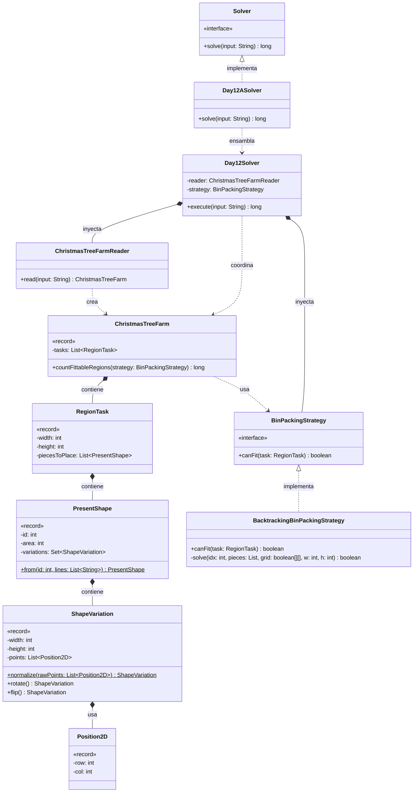

# Día 12: Christmas Tree Farm

## Descripción del Problema

Tras entrar por un conducto de ventilación, descubrimos una enorme granja de árboles de Navidad. Los elfos necesitan colocar regalos bajo los árboles, pero los regalos tienen formas muy extrañas (poliominós) y el espacio está limitado.

*   **Parte A**: Se nos da un catálogo de formas de regalos (con sus índices) y una lista de regiones rectangulares disponibles bajo diferentes árboles. Para cada región, se especifica su tamaño (`Ancho x Alto`) y cuántos regalos de cada forma deben introducirse. Los regalos se pueden rotar y voltear, no pueden superponerse, pero no es necesario rellenar cada hueco vacío de la región. El objetivo es determinar **cuántas regiones pueden acomodar todos los regalos listados**.
*   **Parte B**: *(Pendiente de ser revelada)*.

---

## Explicación de las Relaciones y Elementos

*   **Implementación:** `Day12ASolver` implementa `Solver`, inyectando la estrategia concreta de empaquetado.
*   **Ensamblaje e Inyección:** La tarea de encajar piezas en un tablero 2D es un problema NP-duro que podría requerir estrategias heurísticas avanzadas o algoritmos genéticos en la Parte B si las áreas crecen mucho. Por ello, se inyecta `BacktrackingBinPackingStrategy` en el motor principal `Day12Solver`.
*   **Composición y Uso:** El motor `Day12Solver` le pide al objeto de dominio raíz `ChristmasTreeFarm` que evalúe sus regiones (`countFittableRegions`). Éste a su vez delega el problema geométrico a la `BinPackingStrategy` inyectada.

---

## Arquitectura de Clases y Responsabilidades

- **Ensambladores y Motor Principal:**
    *   `Solver` **(Interfaz):** Contrato global.
    *   `Day12ASolver` **(Clase):** Ensamblador de la Parte A.
    *   `Day12Solver` **(Clase):** Orquestador agnóstico de algoritmos geométricos.
- **Dominio de Búsqueda (Patrón Strategy):**
    *   `BinPackingStrategy` **(Interfaz):** Contrato para el algoritmo de validación de empaquetado.
    *   `BacktrackingBinPackingStrategy` **(Clase):** Implementa DFS con poda heurística (ordenando las piezas por área descendente).
- **Dominio de Lectura y Modelado (Value Objects):**
    *   `ChristmasTreeFarmReader` **(Clase):** Parsea los bloques de texto para construir el catálogo de formas y la lista de tareas de empaquetado.
    *   `ChristmasTreeFarm` **(Record):** *Aggregate Root* inmutable.
    *   `PresentShape` **(Record):** Representa un regalo en el catálogo. Se precalculan todas sus variaciones únicas (rotaciones y reflejos) en su factory estático para no recalcularlas durante el *Backtracking*.
    *   `ShapeVariation` **(Record):** Una variante específica de un regalo, normalizada hacia su esquina superior izquierda para facilitar su anclaje en el tablero.
    *   `RegionTask` **(Record):** Representa el reto individual bajo un árbol (dimensiones y lista plana de piezas a colocar).
    *   `Position2D` **(Record):** Representa coordenadas `(row, col)`.

